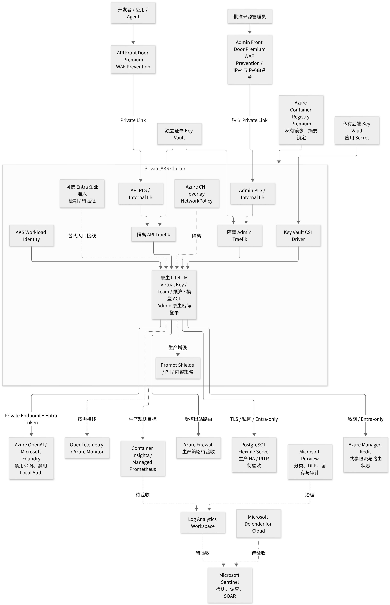
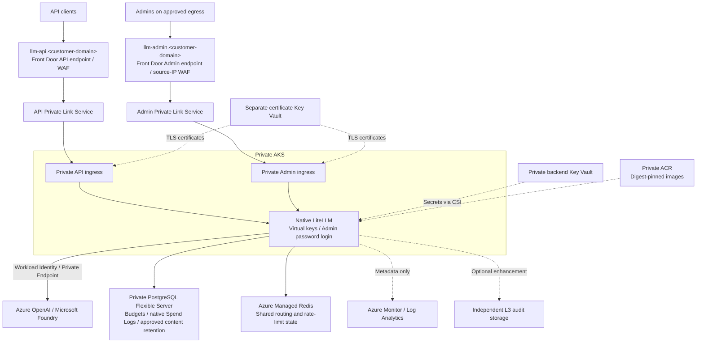

# Security-Enhanced LiteLLM on Azure

[中文](README_ZH.md) | [Customer migration guide (Chinese)](docs/customer-migration-guide-zh.md)

A customer deployment and migration project for a security-enhanced [LiteLLM](https://github.com/BerriAI/litellm) gateway on Azure. It combines Azure infrastructure as code, Kubernetes deployment components, native LiteLLM authentication or an optional customer-owned Microsoft Entra proxy, audit controls and staged delivery workflows.

The delivery target covers both staged migration of existing gateways and greenfield deployment. Customers supply identities, resource IDs, domains and necessary decisions; workflows should perform deployment and verification without requiring customers to author manifests or test code. Model routing uses authorized Azure OpenAI resources within their quotas; the project does not bypass service limits.

> **Current reference (2026-10-09):** the West US 3 (`westus3`) greenfield test gateway uses private AKS and native LiteLLM authentication. The user has verified Admin username/password login and virtual-key Codex Responses inference. This is bounded test evidence, not full production acceptance, a one-click upgrade, or proof of every protocol, failure scenario or model-sync execution.

## Target Architecture



The diagram includes optional and production enhancement paths, not a claim that every component is deployed or accepted. See the [architecture design](docs/litellm-azure-security-hardening-zh.md) for scope and validation boundaries.

**Phase-one audit decision (2026-09-10):** use native Spend Logs for approved prompt/response retention in private PostgreSQL. Native configuration rendering and mode-specific publishing/evidence checks are implemented; static base manifests still disable body logging. Actual retention, access, cleanup, capacity and failure acceptance require separate evidence. Custom L3 capture, Blob/HSM and recovery/governance services are optional enhancements, not a universal launch requirement. See the [phase-one brief](docs/litellm-content-audit-phase1-customer-brief-zh.md) and [deployment guide](docs/customer-deployment-workflows-zh.md). Do not skip gates to enable logging.



| Area | Design and implementation scope |
| --- | --- |
| Network | Private AKS, private endpoints/DNS, controlled egress and default-deny network policies |
| Identity | Current native API uses virtual keys; Admin uses LiteLLM username/password fallback login, not user Entra SSO. Admin WAF Prevention gates exact approved public `/32` and `/128` egress addresses; workload identity authenticates Azure model access |
| Data and secrets | Entra-only PostgreSQL and Redis; private backend and certificate Key Vaults are distinct; backup and restore controls require acceptance |
| Runtime | LiteLLM `1.104.0` pinned source build and digest-based delivery; non-root/read-only baseline, HA and routing components |
| Audit and observation | Native Spend Logs configuration and mode-specific gates; metadata monitoring; optional L3, tracing and Guardrail components |
| Delivery | Customer Environment configuration, OIDC, staged evidence checks, IaC previews and offline validation |

Read-only management checks for this test reference show private AKS `Running/Succeeded`, Azure CNI overlay, Azure RBAC, local accounts disabled, OIDC and workload identity enabled, and two System plus two User nodes of `Standard_D4s_v4`. Front Door Premium has separate API/Admin endpoints and PLS origins to isolated native ingress planes. The Admin WAF uses negated `SocketAddr` IP matching in Prevention mode; both approved IPv4 and IPv6 egress addresses are configured. ARM status alone does not prove Kubernetes rollout, model synchronization or inference.

Additional read-only checks show PostgreSQL 16 `Ready`, Entra authentication enabled, password authentication and public network access disabled; Redis Enterprise (`Microsoft.Cache/redisEnterprise`) `Balanced_B0`, default database access-key authentication disabled, encrypted client protocol and port `10000`. A null Redis cluster `publicNetworkAccess` property does not establish whether public access is enabled or disabled. ACR is Premium with admin user and public access disabled; both Key Vaults use RBAC and disable public access. The Admin allowlist contains three approved exact IPv4 `/32` addresses and one IPv6 `/128`, not an IPv4-only policy.

These are bounded current observations and target capabilities, not universal deployment defaults or production readiness. The solution has no LiteLLM Enterprise dependency. There is no current APIM runtime, public App Service container, shared Admin/API proxy, or legacy West US direct HTTP-IP gateway in this path. The Entra proxy remains an alternative, not the active test gateway.

## Start Here

For approval-bound runtime settings updates, including disabling shared environment-credential Admin login, see the [runtime configuration runbook (Chinese)](docs/litellm-runtime-config-runbook-zh.md). Updates roll the existing backend configuration and persist approved overrides; they do not redeploy Azure infrastructure.

1. Choose migration or greenfield in the [deployment guide](docs/customer-deployment-workflows-zh.md). Existing gateway migration details are in the [migration guide](docs/customer-migration-guide-zh.md).
    If GitHub Actions is unavailable, use the bounded [local Stage 0–9 package (Chinese)](local_execution/README_ZH.md), which supports migration and greenfield. Follow the [Stage 2–9 guide](local_execution/stage2-9-guide-zh.md) for the explicit native-auth branch and its release gates; deferring Entra alone is not permission to release traffic.
2. Fork this repository (public forks are supported), protect the default branch, and configure the selected GitHub Environment and its Azure OIDC identities. Customer operations are manual workflows, never untrusted PR jobs.
3. Use the [migration template](config/customer.example.json) or [greenfield template](config/customer.greenfield.example.json) for the `CUSTOMER_CONFIG_JSON` Environment Secret, and add a separate `WORKFLOW_ARTIFACT_KEY` Secret for encrypted evidence. Greenfield omits `legacy`. Configure OIDC and the [private runner](docs/customer-private-runner-preparation-zh.md); no automated runner platform is required.
4. Start with **Customer staged migration**, stage `0`, mode `config-check`, component `none`, then **Customer private runner checks** with `check_target=false`. Review decrypted results before resource operations. Single-operator `draft → confirm` records actual manual checks without hand-written report JSON.
5. Migration builds an isolated environment alongside the old gateway. Greenfield starts with Stage 0 `bootstrap` then `network` and skips the inapplicable Stage 1. Deployments and releases require approval; successful infrastructure deployment is not application acceptance.

The original migration workflow remains read-only. New [deployment and acceptance workflows](docs/customer-deployment-workflows-zh.md) provide plan-bound ARM deployment, private-runner backup/restore and manifest publishing, and explicit single-operator or dual approval. They do not automatically change DNS or retire the old environment, and outstanding runtime integration blockers still apply. Runtime credentials belong in customer Key Vault, never in the configuration JSON.

## Migration Stages

| Stage | Customer milestone |
| --- | --- |
| 0-2 | Inventory, recoverable backup, minimum legacy hardening and approved architecture decisions |
| 3-5 | Supply chain, isolated target infrastructure, private networking and data migration rehearsal |
| 6-8 | HA/routing, native authentication or optional Entra proxy, split domains, protocol authorization, native content retention and monitoring; optional enhanced audit |
| 9 | Approved pilot, cutover and verified rollback window; retirement is a separate change |

Keep the old database, gateway, identity and Master/Salt path until rollback criteria are met. Do not connect the candidate version to the old production database for an automatic schema migration.

## Repository Map

| Path | Purpose |
| --- | --- |
| [config](config/customer.example.json) | Public customer configuration and evidence examples; no real customer values |
| [.github](.github/README_ZH.md) | Validation, staged migration and image promotion workflows |
| [infra](infra/README_ZH.md) | Bicep platform, backup, monitoring, audit and edge templates |
| [deploy](deploy/README_ZH.md) | Kustomize base, staged components and validation overlays |
| [auth-proxy](auth-proxy/README_ZH.md) | Optional customer-owned Entra API/admin proxy and enhanced audit governance code; not the current native path |
| [LiteLLM](LiteLLM/README.md) | Legacy gateway reference, operational runbooks and OSS callback adapter |
| [tests](tests/README.md) | Offline checks, isolated runtime probes and explicitly invoked live tests |
| [scripts](scripts/customer_migration.py) | Customer preflight, parameter rendering and validation tools |
| [images](images/) | Version-controlled architecture diagrams |

For model discovery/synchronization, use the dedicated [model-sync runbook (Chinese)](docs/litellm-model-sync-runbook-zh.md); do not rerun the legacy deployment script or enable UI database model management for the current gateway.

## Local Validation

Prerequisites: Python 3.10+, Node.js 24, Azure CLI with Bicep, kubectl and make. The OSS callback probes additionally require Docker. From the repository root:

```bash
python3 -m venv .venv
.venv/bin/python -m pip install -r requirements.txt
npm ci --prefix auth-proxy --ignore-scripts
make validate-stage9
make validate-oss-callbacks
.venv/bin/python -m unittest tests.test_customer_migration tests.test_customer_templates tests.test_public_config
```

These checks do not deploy resources or call customer gateways. Dependency installation and uncached container images need download access. Live protocol, private-network, Entra and Azure data-plane tests require a separately approved environment; see the [test guide](tests/README.md).

## Readiness and Cost

- Supported routes in the secure front door are deliberately restricted. Legacy image, video, WebSocket and Codex test results do not establish compatibility with the new authorization layer.
- Phase one uses native Spend Logs, not mandatory custom L3. Native-mode publishing and mode-aware evidence checks exist; actual query access, retention/capacity and recovery acceptance remain required. Native logs do not guarantee zero loss or immutable evidence. Enhanced L3 requires separate approval and validation when selected.
- The current test path has private ingress and identity/data wiring; HA/failure behavior, monitoring data flow and production readiness still need their own acceptance. Do not apply placeholder validation overlays to production.

Use the [migration guide](docs/customer-migration-guide-zh.md), [local Stage 2–9 guide](local_execution/stage2-9-guide-zh.md) and [architecture](docs/litellm-azure-security-hardening-zh.md) for current boundaries. The [completion backlog](docs/litellm-code-completion-backlog-2026-09-07.md) and [implementation roadmap](docs/litellm-security-hardening-implementation-roadmap-zh.md) include historical engineering context, not current customer acceptance reports.

Estimate costs using the [security-enhanced BOM](docs/litellm-bom-cost-comparison-zh.md) and [Azure Pricing Calculator](https://azure.microsoft.com/en-us/pricing/calculator/). Customer region, HA, Firewall, private endpoints, edge traffic, database size and audit retention determine the bill; legacy single-node estimates are not representative of this architecture.
