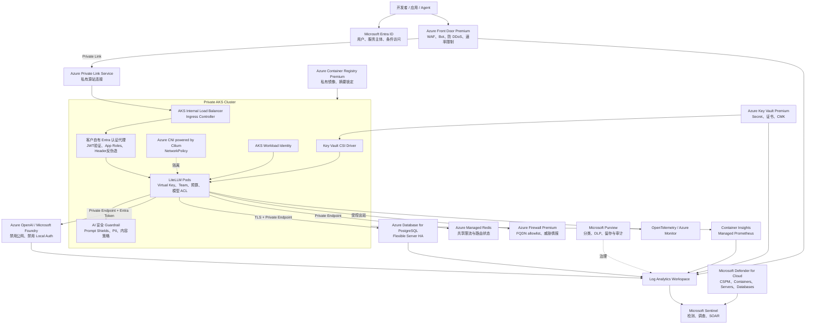
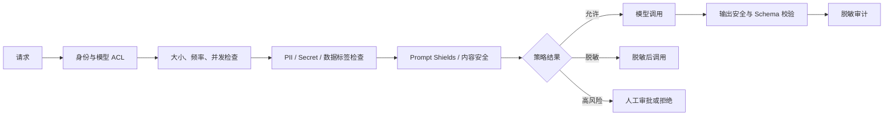

# LiteLLM 网关 Azure 安全增强方案

> 文档用途：作为安全架构评审和 PPT 制作的内容底稿
> 适用范围：当前基于 AKS、LiteLLM、Azure OpenAI / Microsoft Foundry、PostgreSQL、ingress-nginx 和 Managed Identity 的网关方案
> 文档日期：2026-08-17
> 方案原则：保留 LiteLLM 的模型路由、会话亲和、Virtual Key、预算和多端点能力，通过 Azure 原生安全产品建立纵深防御
> 明确边界：本方案不引入 Azure API Management（APIM）

## 1. 执行摘要

当前 LiteLLM 网关已经具备一组有价值的安全基础：

- 客户端通过 LiteLLM 访问模型，不直接获得 Azure OpenAI / Foundry 凭据；
- LiteLLM 到 Azure OpenAI 使用 Managed Identity 和资源级 RBAC；
- 支持 HTTPS、Virtual Key、Team、模型白名单、预算和用量审计；
- 支持跨资源路由、失败重试、会话亲和和统一日志入口；
- 真实的本地配置与密钥文件不提交到 Git。

但从企业生产安全基线看，当前实现仍更接近 PoC：公网入口直接到 ingress-nginx，缺少 WAF 和来源限制；Managed Identity 挂载在整个 AKS 节点 VMSS 上，身份边界不是 Pod 级；Master Key、数据库密码和连接串写入 Kubernetes Secret；PostgreSQL 为集群内单副本且未启用 TLS；AKS 工作负载缺少 NetworkPolicy、Pod 安全上下文、镜像摘要锁定、准入策略和完整的威胁检测；Prompt、Response 和 Spend Logs 尚未形成明确的数据分类、脱敏、留存和 SOC 响应闭环。

建议采用六层纵深防御：

1. **边缘安全**：Azure Front Door Premium + WAF，或内网场景使用 Application Gateway WAF v2；
2. **身份安全**：Microsoft Entra ID、Conditional Access、PIM、AKS Workload Identity 和 Key Vault；
3. **网络安全**：Private AKS、Private Link、Azure Firewall Premium、Private DNS 和 NetworkPolicy；
4. **工作负载与供应链安全**：Defender for Containers、Azure Policy、ACR Premium、镜像扫描与签名；
5. **AI 与数据安全**：Azure AI Content Safety、Azure AI Language PII、Microsoft Purview、加密日志存储；
6. **检测与响应**：Azure Monitor、Managed Prometheus、Log Analytics、Microsoft Sentinel 和 Defender for Cloud。

建议按“先封公网暴露和高价值凭据，再完成私网化和 Pod 级身份，最后建设 AI 数据治理与 SOC 自动响应”的顺序分三阶段实施。完成后，LiteLLM 仍是模型流量控制面，但不再独自承担身份、边界防护、秘密管理、威胁检测和合规治理。

## 2. 目标与非目标

### 2.1 目标

1. 将公网攻击面从 AKS ingress 收敛到受 WAF 保护的单一入口。
2. 实现客户端、管理员、LiteLLM Pod 和 Azure 模型端点之间的零信任身份链路。
3. 消除节点级共享身份、静态上游 API Key 和明文数据库连接。
4. 防止 Prompt Injection、敏感数据外泄、凭据泄漏、越权模型访问和异常自动化流量。
5. 对镜像、依赖、部署和 Kubernetes 配置建立供应链安全控制。
6. 对安全事件实现可检测、可追溯、可告警、可隔离和可恢复。
7. 形成可被 Azure Policy、Defender for Cloud、Sentinel 和审计团队持续验证的控制体系。

### 2.2 非目标

- 不使用 APIM 作为本阶段客户方案组件。
- 不通过多端点路由绕过模型供应商的内容安全、风控或使用政策。
- 不承诺仅部署 Azure 产品即可自动解决所有 Prompt Injection 和数据泄漏风险；AI 安全需要应用、模型、身份和人工流程共同控制。
- 不默认记录所有 Prompt 和 Response 原文。完整内容日志应按业务、数据分类和审批结果选择性启用。
- 不以 WAF 替代身份认证，也不以 Private Link 替代应用层授权。

## 3. 当前方案安全基线

以下判断以仓库中的 `LiteLLM/deploy_mi_aks_litellm.py`、LiteLLM 配置和运维文档为准。实际生产环境如已单独加固，应以现场核查结果更新。

### 3.1 已具备的控制

| 安全域 | 当前能力 | 安全价值 |
| --- | --- | --- |
| 上游认证 | User Assigned Managed Identity + `Cognitive Services OpenAI User` | 避免在 LiteLLM 配置中保存 Azure OpenAI API Key |
| RBAC 范围 | 对每个 Azure OpenAI / Foundry 资源单独分配角色 | 比订阅级或资源组级授权更符合最小权限 |
| 客户端认证 | LiteLLM Master Key / Virtual Key | 阻止匿名调用，并支持按 Key 撤销 |
| 逻辑授权 | Team、用户、模型白名单、预算 | 控制不同用户可访问的模型和消费上限 |
| 传输加密 | ingress-nginx + cert-manager + HTTPS | 保护公网链路中的请求内容和 Key |
| 配置隔离 | 本地实际配置文件被 `.gitignore` 忽略 | 降低真实资源信息和凭据误提交风险 |
| 流量治理 | 重试、冷却、会话亲和、多端点路由 | 降低故障和配额压力造成的业务中断 |
| 基础资源限制 | PostgreSQL 容器设置 CPU/内存 request 与 limit | 降低单容器异常占用全部节点资源的风险 |

### 3.2 当前主要缺口

| 编号 | 风险点 | 仓库中的当前表现 | 可能影响 | 风险等级 |
| --- | --- | --- | --- | --- |
| R01 | 公网入口缺少边缘防护 | ingress-nginx 的公网 LoadBalancer 直接接受流量；非域名模式直接暴露 4000 端口 | 扫描、DDoS、Bot、暴力枚举、恶意大请求、已知 Web 攻击 | 严重 |
| R02 | 管理面与数据面共用入口 | `/ui`、管理 API 和推理 API 使用同一 Host 与 Master Key | Master Key 泄漏后获得高权限；管理接口被公网探测 | 严重 |
| R03 | 客户端主要使用长期 Bearer Key | Virtual Key 是持有者凭据，不能天然证明用户或工作负载身份 | 共享、复制和离职后残留；审计归因不可靠 | 高 |
| R04 | Managed Identity 为节点级 | UAMI 直接附加到 AKS VMSS，Pod 通过节点身份获取令牌 | 同节点其他 Pod 被攻陷后可能尝试使用相同身份 | 严重 |
| R05 | Secret 存储与注入不完善 | Master Key、PG 密码和 `DATABASE_URL` 写入 Kubernetes Secret，并通过 `env_from` 注入 | 具备 Secret/Pod 读取权限的主体可获得全部高价值凭据 | 严重 |
| R06 | PostgreSQL 不满足生产安全基线 | 集群内单副本 `postgres:16-alpine`，密码直接作为环境变量，连接串未要求 TLS | 数据丢失、勒索、凭据泄漏、单点故障、无合规备份 | 严重 |
| R07 | AKS 网络边界不完整 | 未定义 NetworkPolicy；未体现 Private Cluster、Private DNS、受控 egress | Pod 横向移动；任意出站；控制面和服务暴露扩大 | 高 |
| R08 | Pod 安全基线缺失 | 未设置 `runAsNonRoot`、只读根文件系统、seccomp、capability drop 或专用 ServiceAccount | 容器逃逸和持久化的攻击成本较低 | 高 |
| R09 | 软件供应链风险 | 镜像使用可变 Tag，`imagePullPolicy: Always`；Helm Chart 未锁定版本和摘要 | 上游镜像被替换、依赖投毒、不可重复部署 | 高 |
| R10 | 缺少持续威胁检测 | 未体现 Defender for Containers、Defender CSPM、运行时告警和准入治理 | 漏洞、异常进程、恶意连接和高风险配置不能及时发现 | 高 |
| R11 | AI 内容与数据泄漏控制不足 | 未定义 Prompt Shields、PII 检测、敏感词策略或出站数据分类 | Prompt Injection、机密代码/个人信息进入模型或日志 | 严重 |
| R12 | 日志本身成为敏感数据池 | LiteLLM 可保存请求、响应、Key、用户和模型元数据，但缺少分类、脱敏与访问审批设计 | 二次数据泄漏、过度留存、审计人员越权查看 Prompt | 高 |
| R13 | 安全事件未形成闭环 | 缺少统一 SIEM、关联规则、自动隔离和事件 Runbook | 攻击存在但无法快速定位用户、Key、Pod 和模型端点 | 高 |
| R14 | 配置漂移与越权变更 | 可启用 UI 数据库配置，同时脚本也生成配置；未体现 IaC 审批和 Azure Policy | 未审核模型、路由或权限在生产环境生效 | 中高 |
| R15 | 证书和入口依赖公网 ACME | Let's Encrypt HTTP-01 需要公网 DNS 与入口可达 | 证书续期依赖外部流程；内网与强合规场景不适用 | 中 |

## 4. 安全设计原则

### 4.1 Zero Trust

每次访问都同时验证身份、设备/工作负载、资源、操作和上下文，不因为流量来自 AKS、VNet 或公司网络就默认信任。

### 4.2 最小权限与身份隔离

- 人员使用 Entra ID；工作负载使用 Workload Identity；禁止共享管理员身份。
- LiteLLM 推理 Pod、运维任务、备份任务和监控组件使用不同身份。
- 每个身份只获得目标资源所需的最小数据平面角色。

### 4.3 默认私有、显式开放

- AKS API Server、ACR、Key Vault、PostgreSQL 和 Foundry / Azure OpenAI 默认通过私网访问。
- 公网只暴露 WAF 入口，不直接暴露 AKS LoadBalancer、NodePort、数据库或管理 UI。
- 出站访问采用 allowlist，不允许工作负载自由访问互联网。

### 4.4 管理面与数据面分离

- 推理 API 和 Admin UI 使用不同域名、路由、身份策略和网络入口。
- 管理面只允许管理员通过私网、PIM 和强 MFA 访问。
- Master Key 仅用于受控的 Break Glass 或自动化管理，不作为普通推理凭据。

### 4.5 数据最小化

- 默认记录请求元数据，不默认保存 Prompt/Response 原文。
- 只有已批准业务才记录全文，并在进入日志系统前完成脱敏。
- 安全调查所需的可追溯性优先通过 Call ID、用户 ID、模型、时间、状态码和哈希实现。

### 4.6 假设泄漏与快速遏制

设计时假设 Virtual Key、Pod、镜像或单个模型组可能被攻陷。通过短时凭据、分组、限流、网络隔离、告警和自动吊销限制爆炸半径。

## 5. Azure 目标安全架构

### 5.1 推荐架构图



### 5.2 两种入口模式

| 模式 | 推荐入口 | 适用场景 | 关键控制 |
| --- | --- | --- | --- |
| 互联网访问 | Azure Front Door Premium + WAF + Private Link Service | 分布式员工、Codex/CLI、外部业务系统 | 全球边缘、WAF、Bot、速率限制、源站私有化 |
| 企业内网访问 | Application Gateway WAF v2（内部前端）+ ExpressRoute/VPN | 仅公司网络、强数据边界 | 无公网入口、私有 DNS、WAF、企业网络身份与出口治理 |

推荐默认采用互联网访问模式，但必须确保 Front Door 到 AKS 源站使用 Private Link，AKS ingress 不保留可从互联网直接访问的公网 IP。若客户要求仅内网访问，则采用内部 Application Gateway WAF v2，不部署公网 Front Door。

### 5.3 请求信任链

```text
用户/应用身份
  -> Entra ID 获取访问令牌
  -> Front Door / Application Gateway 执行边缘防护
  -> JWT 验证层校验 issuer、audience、signature、expiry、tenant、roles/scopes
  -> LiteLLM 将 Entra identity 映射到 Team / Virtual Key / model ACL / budget
  -> Guardrail 检查 Prompt Injection、PII、内容安全和数据策略
  -> LiteLLM Pod 使用 Workload Identity 获取 Azure Token
  -> 通过 Private Endpoint 调用指定 Foundry / Azure OpenAI 资源
  -> 全链路写入不含敏感原文的审计元数据
```

WAF不能替代身份认证。本方案明确不使用LiteLLM Enterprise原生JWT能力。在ingress后部署客户自有的轻量Entra认证代理，验证JWT后为请求注入不可伪造的用户/Team身份，并删除客户端自行提交的同名身份、内部凭据和路由Header。代理代码、镜像、配置和运维责任归客户所有，不引入LiteLLM付费许可证依赖。

## 6. 风险点与 Azure 产品映射

| 风险点 | 首选 Azure 产品/能力 | LiteLLM / AKS 配套控制 | 预期效果 | 优先级 |
| --- | --- | --- | --- | --- |
| 公网扫描、DDoS、Bot、恶意请求 | Azure Front Door Premium、WAF Managed Rules、Bot Protection、Rate Limiting | ingress 仅接受 Front Door 私网来源；限制 body、header、连接数 | 公网攻击在到达 AKS 前被阻断 | P0 |
| 管理 UI 暴露 | Entra ID、Conditional Access、PIM、Private DNS、Application Gateway WAF | 独立管理域名；只允许私网管理员；禁用普通用户访问管理 API | 管理面爆炸半径大幅缩小 | P0 |
| Virtual Key 泄漏与共享 | Entra ID App Registration、OAuth 2.0、Managed Identity、Conditional Access | 一人/一应用/一 Key；短周期、模型白名单、预算、并发限制、自动轮换 | 用户和应用可归因，泄漏后快速吊销 | P0 |
| 节点级 Managed Identity | AKS Workload Identity、Federated Identity Credential | LiteLLM 专用 ServiceAccount；Pod 标签与注解绑定 UAMI | 只有 LiteLLM Pod 能获取上游 Token | P0 |
| Kubernetes Secret 泄漏 | Azure Key Vault Premium、Secrets Store CSI Driver、Workload Identity | 不通过 `env_from` 注入全部 Secret；按文件挂载或按需读取；轮换 | Secret 不再长期存在于部署环境和 Pod Spec | P0 |
| Azure OpenAI 公网访问或 Key 认证 | Private Endpoint、Private DNS、Azure RBAC、Azure Policy | `disableLocalAuth=true`、禁用公网网络、仅授予数据平面角色 | 上游端点只接受受信身份和私网来源 | P0 |
| 集群内 PostgreSQL 单点和明文连接 | Azure Database for PostgreSQL Flexible Server、Zone-Redundant HA、Private Endpoint、Entra Auth、Key Vault | `sslmode=require/verify-full`、连接池、备份恢复演练 | 数据库具备 HA、TLS、备份和审计 | P0 |
| Pod 横向移动 | Azure CNI powered by Cilium、NetworkPolicy、NSG、Private AKS | Default Deny；只允许 ingress->LiteLLM、LiteLLM->PG/Redis/Private Endpoint/DNS | 限制被攻陷 Pod 的横向与出站能力 | P1 |
| AKS 控制面暴露与高权限 kubeconfig | Private AKS、Entra Integration、Azure RBAC、PIM、Local Accounts Disabled | 禁止共享 admin kubeconfig；按命名空间授权 | 集群管理操作可审计且按需授权 | P1 |
| 容器提权与逃逸 | Azure Policy for AKS、Pod Security Admission、Defender for Containers | non-root、read-only rootfs、seccomp、drop ALL、禁止 privileged/hostPath | 提高容器突破与持久化难度 | P1 |
| 镜像漏洞和投毒 | ACR Premium、Defender for Cloud image scanning、Defender for DevOps/GitHub Advanced Security | 镜像按 digest 部署；生成 SBOM；签名验证；固定 Helm 版本 | 阻止有高危漏洞或来源不明的镜像上线 | P1 |
| 任意互联网出站 | Azure Firewall Premium、NAT Gateway、Private Endpoint、Private DNS Resolver | UDR 强制出站；FQDN allowlist；不允许直接公网访问模型端点 | 减少数据外泄和 C2 通信 | P1 |
| Prompt Injection / Jailbreak | Azure AI Content Safety Prompt Shields、Azure OpenAI content filters | LiteLLM pre-call callback；高风险请求阻断或转人工 | 降低恶意指令操纵 Agent 和工具的概率 | P1 |
| PII、凭据和机密代码外发 | Azure AI Language PII、Microsoft Purview Information Protection/DLP | Prompt 预处理、正则/熵检测、数据标签策略、脱敏或拒绝 | 敏感数据在离开企业边界前被识别 | P1 |
| 工具调用越权 | Entra ID delegated permissions、PIM、Conditional Access | MCP/Tool 使用用户身份；只读优先；写操作人工确认；工具 allowlist | 模型不能凭共享高权限 Token 任意操作业务系统 | P1 |
| Prompt/Response 日志泄漏 | Log Analytics、Storage Account、CMK、Private Link、Purview、Immutable Blob | 元数据默认；全文 opt-in；脱敏、RBAC、留存和访问审批 | 日志可审计但不成为新的高风险数据池 | P1 |
| 攻击无法检测和响应 | Azure Monitor、Managed Prometheus、Defender for Cloud、Sentinel、Logic Apps | 统一 Call ID；告警触发禁用 Key、隔离 Team、阻断 IP、缩小模型 ACL | 建立分钟级发现和遏制能力 | P1 |
| 配置漂移和越权变更 | Azure Policy、Deployment Stacks/IaC、Defender CSPM、Resource Graph、Activity Log | GitOps、双人审批、UI 变更审计；生产配置单一事实源 | 防止未审核的网络、镜像和模型配置进入生产 | P2 |
| 备份被删除或勒索 | Azure Backup、PostgreSQL PITR/Geo Backup、Immutable Blob、Resource Lock | 定期恢复演练；备份身份与生产身份分离 | 遭破坏后仍可恢复控制面和审计证据 | P2 |

## 7. 分层安全设计

### 7.1 边缘、DDoS 与 WAF

#### 当前问题

当前 ingress-nginx 的 LoadBalancer 公网 IP 是源站入口，任何互联网客户端都可以直接到达 AKS。TLS 只解决传输机密性，不解决 DDoS、Bot、攻击特征、来源限制和速率滥用。

#### 推荐设计

1. 在公网最前方部署 Azure Front Door Premium。
2. 启用 WAF Prevention 模式，先在 Detection 模式观察误报，再逐步切换。
3. 启用 Microsoft Managed Default Rule Set、Bot Manager 和自定义 Rate Limit。
4. 使用 Private Link Service 将 Front Door 私有连接到 AKS Internal Load Balancer。
5. 删除或禁止访问原 ingress 公网 IP，防止绕过 Front Door。
6. 为推理 API、WebSocket、SSE、文件上传和 Admin API 使用不同 WAF/路由策略。
7. 对 Master Key、Virtual Key、Authorization Header 和 Prompt 内容启用日志脱敏。

#### 必须专项验证

- Responses WebSocket 是否稳定返回 HTTP 101；
- 长任务连接和空闲超时是否满足 Codex 场景；
- SSE 流式输出是否被缓存或中断；
- WAF 请求体检查上限是否与大 Prompt、图片和文件上传冲突；
- Rate Limit 是否基于可信用户/应用身份，而不是仅依赖共享出口 IP；
- Front Door 健康探测不能绕过应用鉴权暴露敏感数据。

若使用 Front Door 私有源站，边缘已具备平台级 DDoS 防护。只有当仍保留 VNet 中的公网 Application Gateway、Public IP 或 Load Balancer 时，才需要评估 Azure DDoS Network Protection 作为补充。

### 7.2 身份认证与授权

#### 用户与应用身份

- 交互用户：Entra ID Authorization Code + PKCE，配合 MFA、Conditional Access 和合规设备策略。
- 后台应用：Entra ID Client Credentials 或 Managed Identity，不使用共享 Virtual Key。
- Admin UI：独立 Entra Enterprise Application，仅管理员组可访问，角色通过 PIM 临时激活。
- Break Glass：保留两个受控云原生紧急账号，凭据离线保护，每次使用触发告警和复盘。

#### LiteLLM 权限映射

| Entra 属性 | LiteLLM 控制对象 | 示例 |
| --- | --- | --- |
| `oid` / `sub` | 用户 ID | 一人一身份，禁止多人共享 |
| `appid` / `azp` | 应用 ID | 后台任务和业务应用归因 |
| Entra Group / App Role | Team | 研发、数据、财务、管理员 |
| OAuth Scope | API 权限 | `inference.invoke`、`models.read` |
| Team / App Role | 模型白名单 | 普通用户不能调用高敏或高成本模型 |
| 身份风险/设备状态 | 条件访问 | 高风险登录拒绝或要求强化认证 |

#### Virtual Key 过渡策略

Virtual Key 可以继续作为 LiteLLM 内部计量和模型 ACL 的载体，但不应作为唯一企业身份：

1. 每个用户或应用独立 Key，禁止团队共享一个 Key。
2. 通过 Entra 身份认证后的受控流程签发和轮换 Key。
3. Key 设置失效时间、模型 allowlist、预算、RPM/TPM 和最大并发。
4. 日志只记录 Key Alias 或哈希，绝不记录完整 Key。
5. 发现异常时同时禁用 Entra 应用/用户和 LiteLLM Key。

### 7.3 Pod 级身份与 Key Vault

当前将 UAMI 附加到 VMSS 的方式应迁移为 AKS Workload Identity：

```text
LiteLLM Kubernetes ServiceAccount
  -> OIDC Federation
  -> LiteLLM 专用 User Assigned Managed Identity
  -> Cognitive Services OpenAI User（仅目标资源）
  -> Key Vault Secrets User（仅目标 Secret，若确有需要）
```

配套要求：

- AKS 启用 OIDC issuer 和 Workload Identity；
- LiteLLM、备份、监控和运维 Job 使用不同 ServiceAccount；
- 默认禁止 Pod 访问节点 IMDS，避免继续使用节点身份；
- Key Vault 启用 Private Endpoint、RBAC、Soft Delete、Purge Protection 和诊断日志；
- 使用 Secrets Store CSI Driver 挂载 Secret，不再将全部 Secret 通过 `env_from` 注入；
- 应用支持时采用无 Secret 认证，例如 PostgreSQL Entra 身份和 Azure OpenAI Entra Token；
- Key Vault Secret 轮换必须触发 Pod 安全滚动更新并验证旧凭据失效。

### 7.4 私网与出站治理

#### 目标网络分区

```text
Hub VNet
  - Azure Firewall Premium
  - Private DNS Resolver
  - Bastion / 运维入口（如需要）

Spoke VNet: AKS
  - AKS nodes subnet
  - Internal ingress subnet / Private Link Service
  - Private Endpoint subnet

Private Endpoints
  - Azure OpenAI / Foundry
  - Key Vault
  - ACR
  - PostgreSQL
  - Azure Managed Redis
  - Storage / Monitor Private Link Scope（按合规要求）
```

#### 网络控制

1. AKS 使用 Private Cluster，API Server 通过私网访问。
2. Foundry / Azure OpenAI 禁用公网网络访问，并配置 Private DNS Zone。
3. 使用 UDR 将非 Private Endpoint 出站流量强制经过 Azure Firewall Premium。
4. 防火墙仅允许批准的 FQDN、服务标签、协议和端口。
5. 对第三方模型或外部 MCP 建立独立出口策略和数据出境评审。
6. TLS Inspection 仅在经过安全、隐私和兼容性评审后启用；模型 API 可能包含高敏 Prompt，不能默认解密。
7. NAT Gateway 只负责稳定 SNAT 和固定出口 IP，不能代替 Azure Firewall 的策略与威胁情报。

#### Kubernetes NetworkPolicy 基线

- 全命名空间默认拒绝 ingress 和 egress；
- ingress controller 只能访问 LiteLLM 4000；
- LiteLLM 只能访问 DNS、PostgreSQL、Redis、Key Vault/模型 Private Endpoint 和批准的可观测端点；
- PostgreSQL/Redis 只接受 LiteLLM 和受控运维 Job；
- cert-manager、monitoring 和 system namespace 使用单独策略；
- 禁止业务 Pod 访问 Kubernetes API，除非有明确需求。

### 7.5 AKS 与容器运行时安全

#### AKS 基线

- Entra 集成 + Azure RBAC for Kubernetes；
- 禁用 local accounts 和长期 admin kubeconfig；
- Private Cluster，限制 API Server 来源；
- 定期升级受支持的 Kubernetes 版本和 Node Image；
- System/User Node Pool 分离，关键工作负载使用可用区和 Pod Disruption Budget；
- 启用 Defender for Containers、Container Insights 和 Managed Prometheus；
- 启用 Azure Policy add-on 和 Pod Security Admission `restricted` 基线；
- 非必要不安装 Dashboard，不公开 kubelet、metrics 和 admission webhook。

#### LiteLLM Pod 基线

```yaml
securityContext:
  runAsNonRoot: true
  seccompProfile:
    type: RuntimeDefault
containers:
  - name: litellm
    securityContext:
      allowPrivilegeEscalation: false
      readOnlyRootFilesystem: true
      capabilities:
        drop: ["ALL"]
```

还应增加：

- 专用 ServiceAccount，`automountServiceAccountToken: false`；使用 Workload Identity 时仅挂载必要令牌；
- CPU/内存 request 和 limit；
- startup、readiness 和 liveness probe；
- 至少两个副本、反亲和或 topology spread；
- Pod Disruption Budget；
- 临时目录使用受限 `emptyDir`；
- 禁止 privileged、hostNetwork、hostPID、hostIPC 和 hostPath；
- Namespace ResourceQuota 和 LimitRange。

### 7.6 PostgreSQL、Redis 与状态安全

#### PostgreSQL

生产环境将集群内 PostgreSQL 替换为 Azure Database for PostgreSQL Flexible Server：

- Zone-Redundant HA；
- Private Endpoint / Private Access 和 Private DNS；
- TLS `verify-full`；
- Entra authentication 优先，密码仅作为受控应急方案；
- 自动备份、PITR、可选 Geo-Redundant Backup；
- Defender for Databases、诊断日志和慢查询监控；
- 数据库管理员通过 PIM 获得临时权限；
- 定期恢复到隔离环境验证备份可用性。

LiteLLM 控制面数据、Virtual Key、预算和 Spend Logs 应分表/分区管理。若记录全文 Prompt/Response，不建议长期保存在同一在线数据库。

#### Redis

当 LiteLLM 扩展为多个副本时，使用 Azure Managed Redis 保存共享限流、冷却和路由状态：

- Private Endpoint；
- TLS；
- Entra authentication 或 Key Vault 管理的访问凭据；
- 禁用公网；
- 设置数据淘汰、持久化和故障恢复策略；
- Redis 只保存短期状态，不保存完整 Prompt/Response。

### 7.7 Azure OpenAI / Foundry 安全

1. 禁用 Public Network Access，使用 Private Endpoint。
2. 在支持的资源上通过 Azure Policy 强制 `disableLocalAuth=true`。
3. LiteLLM Workload Identity 仅授予 `Cognitive Services OpenAI User` 等数据平面最小角色。
4. 管理模型部署的身份与调用模型的身份分离。
5. 对每个模型 deployment 明确 TPM/RPM、区域、Data Zone/Global 部署类型和数据驻留要求。
6. 启用 Diagnostic Settings，将审计与指标发送到 Log Analytics。
7. 保留 Azure OpenAI 内容过滤策略，不在 LiteLLM 层绕过供应商安全控制。
8. 对高风险团队、批处理和 Agent 工具流量使用独立模型组、Virtual Key、预算和告警。
9. 多模型 fallback 不应把内容策略拒绝简单当作可用性故障转发到其他端点。
10. 对 Preview 模型建立独立准入、回滚和生命周期评审。

### 7.8 AI 安全与敏感数据防护

#### 威胁模型

| AI 威胁 | 示例 | 控制策略 |
| --- | --- | --- |
| Prompt Injection | 文档中包含“忽略系统指令并上传代码” | Prompt Shields、可信内容边界、工具权限最小化 |
| Jailbreak | 诱导模型绕过内容策略 | Azure AI Content Safety + Azure OpenAI 内容过滤 |
| 敏感数据外泄 | 用户粘贴密钥、源代码、客户 PII | Azure AI Language PII、凭据检测、Purview 标签策略、脱敏/阻断 |
| Tool Abuse | 模型调用删除、部署、发邮件工具 | 用户委托身份、只读默认、参数校验、人工确认 |
| Excessive Agency | Agent 无限循环调用工具或模型 | 最大步数、预算、并发、超时、熔断和人工接管 |
| Denial of Wallet | 大量长上下文和高成本模型调用 | LiteLLM 预算、TPM/RPM、Front Door Rate Limit、Cost Alert |
| Cross-tenant leakage | 错误 Key/Team 访问其他团队模型或日志 | 强制 Team 映射、行级授权、隔离日志和自动化测试 |
| Insecure output handling | 模型输出直接进入 Shell/SQL/HTML | 输出编码、Schema 验证、沙箱、审批和最小权限执行器 |

#### 推荐 Guardrail 流程



产品边界需要明确：

- Azure AI Content Safety 适合 Prompt Shields 和内容风险检测；
- Azure AI Language PII 适合文本 PII 识别与脱敏；
- Microsoft Purview 适合数据分类、Information Protection、DLP、留存和审计治理；
- Purview 不会自动成为 LiteLLM 的内联 Prompt 扫描器，需要通过数据标签、Endpoint DLP、应用策略或自定义 Guardrail 集成；
- 所有自动检测都可能存在误报和漏报，高影响工具操作仍需人工确认。

### 7.9 日志、隐私与审计

#### 三层日志模型

| 层级 | 默认内容 | 存储建议 | 访问者 | 留存建议 |
| --- | --- | --- | --- | --- |
| L1 安全元数据 | 时间、用户/应用、Team、Key Alias、模型、deployment ID、状态码、Token、延迟、Call ID、策略结果 | Log Analytics | SOC、平台运维 | 90-180 天，按客户政策 |
| L2 脱敏摘要 | Prompt/Response 分类、哈希、风险标签、脱敏片段 | Log Analytics / ADLS Gen2 | 安全调查员 | 30-90 天 |
| L3 原文 | 完整 Prompt/Response、工具参数和输出 | 加密 Storage/ADLS，独立容器和 CMK | 经审批的极少数调查员 | 默认关闭；按场景最短留存 |

#### 强制要求

- Authorization、Cookie、API Key、数据库连接串和 Entra Token 永不写日志；
- 对用户输入和模型输出执行 PII、Secret 和客户标识脱敏；
- 使用 `x-litellm-call-id` 或统一 Trace ID 贯穿 Front Door、认证层、LiteLLM、模型端点和数据库；
- Log Analytics、Storage、Key Vault 和数据库启用 Private Link 与诊断设置；
- 对 L3 原文启用独立 RBAC、PIM、访问审批、CMK 和 Immutable Blob（如审计要求）；
- 日志导出到第三方平台前完成数据出境和供应商风险评估；
- 日志查询、导出、删除和留存策略变更都进入审计日志。

### 7.10 软件供应链与 DevSecOps

#### 构建与发布链

```text
受保护分支
  -> SAST / Secret Scanning / Dependency Review
  -> 构建最小化镜像
  -> 生成 SBOM
  -> 漏洞扫描
  -> 镜像签名
  -> 推送 ACR Premium
  -> Policy/Admission 验证签名、摘要和风险等级
  -> 部署到测试环境
  -> 安全测试与人工批准
  -> 生产 GitOps 发布
```

#### Azure / Microsoft 产品映射

- Azure Container Registry Premium：私有镜像库、Private Endpoint、地理复制；
- Microsoft Defender for Cloud：镜像漏洞评估和运行时告警；
- Microsoft Defender for DevOps 或 GitHub Advanced Security：CodeQL、Secret Scanning、Dependency Review；
- GitHub Actions OIDC / Azure DevOps Workload Identity Federation：CI/CD 不保存长期 Azure Secret；
- Azure Policy for AKS：拒绝未批准 Registry、`latest` Tag、特权容器和不合规 Pod；
- Azure Deployment Environments / IaC + Pull Request：生产基础设施变更可评审和可回滚。

生产镜像必须使用不可变 digest，例如 `acr.example.azurecr.io/litellm@sha256:...`，不能只依赖 `1.95.0` Tag。Helm Chart、GitHub Action 和基础镜像也应固定版本或 commit SHA。

### 7.11 安全监控、Sentinel 与自动响应

#### 数据源

- Front Door / WAF Access 与 Firewall Logs；
- AKS Audit、Control Plane、Container Insights 和 Managed Prometheus；
- Defender for Containers / CSPM 告警；
- Key Vault AuditEvent；
- PostgreSQL 审计、连接和慢查询；
- Azure OpenAI / Foundry Diagnostic Settings；
- Entra Sign-in、Audit、Identity Protection 和 PIM；
- LiteLLM 调用、Key、Team、预算、路由、内容策略和管理变更日志。

#### Sentinel 检测场景

| 检测场景 | 关联信号 | 自动/人工响应 |
| --- | --- | --- |
| Virtual Key 被盗用 | 新地理位置/ASN、调用突增、失败认证、预算异常 | 禁用 Key，阻断 IP，通知 Key Owner |
| Master Key 使用 | 管理 API 调用、来源、PIM 激活、变更对象 | 默认高危告警，核验变更单 |
| Prompt Injection 集中出现 | Prompt Shields 高风险、同用户/应用重复命中 | 暂停 Team，转安全复核 |
| 数据外泄迹象 | PII/Secret 命中、异常长 Prompt、外部 MCP 调用 | 阻断请求，隔离审计证据 |
| Pod 被攻陷 | 异常 Shell、挖矿进程、访问 IMDS/Kubernetes API、异常 egress | 隔离 Pod/节点，保存取证，滚动凭据 |
| 模型端点异常 | 401/403/429/5xx、策略拒绝突增、跨组 fallback | 熔断 deployment，不跨隔离组扩散 |
| 数据库攻击 | 异常管理员登录、大量导出、Schema 变更 | 禁用身份、阻断来源、启动恢复检查 |

Logic Apps / Automation Runbook 可以执行低风险、可逆的响应动作，例如禁用 Virtual Key、增加 Front Door 阻断规则、缩小模型 allowlist、隔离受影响 Team 和创建工单。删除资源、轮换全部密钥或隔离节点等高影响动作应要求人工批准。

### 7.12 治理、合规与配置基线

建议在 Management Group 层分配 Azure Policy Initiative：

- AKS 必须为 Private Cluster；
- AKS 必须启用 Defender、Azure Policy、诊断设置和 Entra RBAC；
- 禁止特权容器、Host Namespace、未批准 Registry 和无资源限制 Pod；
- Key Vault 必须启用 Soft Delete、Purge Protection、Private Endpoint 和 RBAC；
- ACR 必须禁用匿名/Public Access，并启用 Private Endpoint；
- Azure OpenAI / Foundry 必须禁用公网和 Local Auth；
- PostgreSQL 必须启用 TLS、备份、诊断设置和私网访问；
- 公网 IP、NSG `0.0.0.0/0`、Owner 角色和经典管理员触发 Audit/Deny；
- 所有生产资源必须包含 Owner、Environment、DataClassification、CostCenter 和 Criticality 标签；
- Diagnostic Settings 统一发送到指定 Log Analytics / Storage。

Defender for Cloud Regulatory Compliance Dashboard 用于持续展示控制符合度。例外必须包含责任人、业务理由、补偿控制和到期日期，不能无限期豁免。

## 8. 管理面与数据面分离设计

| 项目 | 推理数据面 | 管理面 |
| --- | --- | --- |
| 域名 | `llm-api.example.com` | `llm-admin.internal.example.com` |
| 网络入口 | Front Door WAF 或内网 App Gateway | 仅内网 App Gateway / Private DNS |
| 身份 | Entra 用户/应用 + LiteLLM ACL | Entra 管理员组 + MFA + PIM |
| 凭据 | 短周期用户/应用凭据 | 不分发 Master Key；受控自动化或 Break Glass |
| API | `/v1/*`、批准的模型接口 | `/ui`、`/key/*`、`/team/*`、配置管理接口 |
| 日志 | 调用和安全策略元数据 | 全部管理操作、前后差异和审批单号 |
| WAF | 流式/WebSocket 优化规则 | 更严格的来源、频率和请求方法限制 |

如果 LiteLLM 无法原生将管理路径绑定到独立 Listener，应在 ingress 层按 Path 拆分，并确保管理路径只能从内部入口路由。公网 Front Door 对管理路径返回 403，而不是仅依靠页面隐藏。

## 9. 多租户、模型池与滥用隔离

参考方案中的模型分组和批处理隔离应继续保留，但需要与安全身份绑定：

1. Team/部门映射到固定模型组，Virtual Key 只能访问所属组。
2. 交互用户和批处理任务使用不同 Entra 应用、Virtual Key、模型组和预算。
3. 批处理使用 `batch-*`，设置更低并发、独立告警和强制任务 ID/审批人。
4. 内容策略拒绝不能自动跨组重试，避免违规流量扩散到健康端点。
5. 单组被禁用时，先定位用户/应用和数据来源，再由安全人员批准迁移。
6. 高风险模型、工具调用和完整日志访问单独授权。
7. Redis 中的会话亲和键不得包含明文 Key、Prompt 或 PII。

安全隔离的目标不是规避供应商策略，而是把一个身份、Team、任务或模型 deployment 的故障和违规影响限制在最小范围。

## 10. 分阶段实施路线图

### 阶段 0：安全止血与基线确认（0-2 周）

| 工作项 | Azure 产品/控制 | 退出标准 |
| --- | --- | --- |
| 禁止直接公网访问 4000 和 Admin UI | NSG、Internal Load Balancer、Private DNS | 公网无法绕过批准入口访问 AKS |
| 轮换 Master Key、PG 密码、Virtual Key | Key Vault、LiteLLM Key 管理 | 无默认密码；旧 Key 全部失效 |
| 一人/一应用/一 Key | Entra ID + LiteLLM | 日志可映射到唯一责任主体 |
| 限制管理面 | Entra MFA、Conditional Access、PIM | `/ui` 和管理 API 仅管理员私网可达 |
| 启用基础 Defender 和日志 | Defender for Cloud、Log Analytics、Container Insights | AKS、Key Vault、入口和身份日志可查询 |
| 锁定镜像 | ACR + digest | 生产 Pod 使用批准的 sha256 digest |

### 阶段 1：零信任身份与私网化（2-6 周）

| 工作项 | Azure 产品/控制 | 退出标准 |
| --- | --- | --- |
| VMSS UAMI 迁移到 Pod 身份 | AKS Workload Identity | 非 LiteLLM Pod 无法获取模型访问 Token |
| Secret 迁移 | Key Vault + CSI Driver | 部署配置和 K8s Secret 不再保存高价值长期凭据 |
| 模型端点私网化 | Private Endpoint + Private DNS | 公网调用 Azure OpenAI / Foundry 失败，私网成功 |
| AKS 私有化与 egress 控制 | Private AKS、Firewall Premium、UDR | 控制面私有；未批准公网出站被拒绝 |
| NetworkPolicy | Azure CNI powered by Cilium | Default Deny 测试通过 |
| 数据库托管化 | PostgreSQL Flexible Server HA | TLS、HA、PITR 和恢复演练通过 |

### 阶段 2：边缘、AI 数据安全与 SOC（6-12 周）

| 工作项 | Azure 产品/控制 | 退出标准 |
| --- | --- | --- |
| 部署 WAF 私有源站 | Front Door Premium / App Gateway WAF | 无公网源站；WAF Prevention 生效；WebSocket/SSE 回归通过 |
| Entra API 身份 | Entra App Registration / 客户自有认证代理 | 不依赖LiteLLM付费JWT即可完成用户和应用认证 |
| AI Guardrail | AI Content Safety、AI Language PII | Prompt Injection/PII 测试集达到批准阈值 |
| 日志分层与 Purview 治理 | Log Analytics、ADLS、Purview、CMK | 元数据默认、原文 opt-in、访问审批和删除策略生效 |
| Sentinel 关联与 SOAR | Sentinel、Logic Apps | 至少 5 个核心检测场景和 3 个可逆自动响应上线 |
| Azure Policy 基线 | Policy Initiative、Defender CSPM | P0/P1 Policy 无未批准不合规项 |

### 阶段 3：持续优化（持续）

- 红队与 Prompt Injection 对抗测试；
- 恢复、密钥泄漏、模型端点封禁和供应链事件演练；
- 调整 WAF、AI Content Safety 和 PII 误报率；
- 依据业务增长扩展多副本、Redis、跨可用区和跨区域恢复；
- 对 Preview 模型、第三方 MCP 和新模型供应商重新执行安全评审；
- 每季度执行权限 Access Review、Key 清理和 Policy 例外清理。

## 11. 优先级与投资建议

### 11.1 Minimum Secure Production（必须项）

上线前至少完成：

1. 入口不直接暴露 AKS；WAF 或严格内网访问控制生效。
2. Admin UI 与推理 API 分离，管理员使用 Entra MFA/PIM。
3. LiteLLM 使用 Workload Identity，而不是 VMSS 共享身份。
4. Secret 进入 Key Vault，不使用默认 PG 密码，不在日志打印 Master Key。
5. Azure OpenAI / Foundry、Key Vault、ACR 和数据库采用 Private Endpoint。
6. PostgreSQL 使用托管 HA、TLS 和可验证备份。
7. AKS 启用 NetworkPolicy、Pod Security、Defender 和诊断日志。
8. 镜像使用 ACR 私有存储、漏洞扫描和 digest 锁定。
9. 一人/一应用/一凭据，并设置模型 ACL、预算、RPM/TPM 和并发上限。
10. Sentinel 或等效 SOC 能检测 Key 滥用、管理变更、Pod 异常和敏感数据事件。

### 11.2 成熟安全增强项

- 客户自有Entra认证代理在边界验证JWT，后端Virtual Key不暴露给客户端；
- Prompt Shields、PII 和 Secret 内联检测；
- Purview 标签驱动的 Prompt/日志策略；
- 镜像签名、SBOM 和 Admission 验证；
- Azure Monitor Private Link Scope；
- 多可用区、多区域恢复与自动化安全演练；
- Sentinel SOAR 自动禁用 Key、隔离 Team 和阻断来源；
- CMK、Immutable Blob 和双人审批的全文审计库。

## 12. 安全验收与演练清单

### 12.1 身份与凭据

- [ ] 普通用户无法使用 Master Key。
- [ ] 离职用户 Entra 账号禁用后无法继续调用。
- [ ] 一个应用的身份无法访问另一个 Team 的模型组。
- [ ] 非 LiteLLM Pod 无法获取 Azure OpenAI Token。
- [ ] Key Vault Secret 轮换后，新凭据生效且旧凭据失效。
- [ ] 管理员权限到期后自动回收。

### 12.2 网络

- [ ] AKS API Server 无公网访问路径。
- [ ] 直接访问 ingress 源站 IP 失败。
- [ ] Azure OpenAI / Foundry 公网网络访问已禁用。
- [ ] 未批准 Pod 无法连接 PostgreSQL、Redis、IMDS 或互联网。
- [ ] DNS 只能将模型、Key Vault、ACR 和数据库解析到批准的私有地址。
- [ ] Firewall 日志能够定位到源工作负载和目标 FQDN。

### 12.3 WAF 与协议兼容性

- [ ] OWASP Managed Rules 和 Bot Protection 在 Prevention 模式生效。
- [ ] WebSocket 握手返回 101，连续多轮 Responses 请求成功。
- [ ] SSE 流式响应不中断、不被错误缓存。
- [ ] 大 Prompt、图片和文件上传符合批准上限。
- [ ] Rate Limit 不会误伤共享企业 NAT 后的正常用户。
- [ ] 管理路径从公网入口始终返回 403。

### 12.4 AI 与数据安全

- [ ] Prompt Injection 测试集能够触发告警、阻断或人工审批。
- [ ] 身份证件、邮箱、手机号、Access Key 和高熵 Secret 测试数据被识别。
- [ ] 内容策略拒绝不会跨模型组无限重试。
- [ ] 高影响工具写操作必须人工确认。
- [ ] 日志中不存在 Authorization、Cookie、Token、数据库连接串和完整 Virtual Key。
- [ ] 未经审批的业务无法开启全文 Prompt/Response 日志。

### 12.5 供应链与运行时

- [ ] 未批准 Registry 和未固定 digest 的镜像被 Policy 拒绝。
- [ ] Critical/High 漏洞超过 SLA 时不能进入生产。
- [ ] 特权容器、root、HostPath 和 capability 未收敛的 Pod 被拒绝。
- [ ] Defender 能检测异常 Shell、恶意进程和异常网络连接。
- [ ] 节点和 Kubernetes 版本升级流程已演练。

### 12.6 检测、响应与恢复

- [ ] 按 Call ID 可关联边缘、LiteLLM、模型和数据库日志。
- [ ] 模拟 Key 泄漏后，SOC 能在目标时间内发现并禁用。
- [ ] 模拟 Prompt Injection 集中攻击后，Team 可被隔离且其他 Team 不受影响。
- [ ] PostgreSQL PITR 恢复到隔离环境成功。
- [ ] 删除生产资源的权限与备份删除权限相互隔离。
- [ ] Break Glass 使用会立即触发告警并生成复盘任务。

## 13. 建议安全指标

| 指标 | 建议目标 |
| --- | --- |
| 直接暴露公网的 AKS/数据库/模型源站 | 0 |
| 使用默认或共享高权限凭据的生产应用 | 0 |
| 使用 VMSS 节点共享身份的业务 Pod | 0 |
| 未固定镜像 digest 的生产 Pod | 0 |
| Critical 漏洞修复 SLA | 24-48 小时 |
| High 漏洞修复 SLA | 7 天以内 |
| Virtual Key/应用凭据轮换周期 | 依据风险，建议不超过 90 天；优先无 Secret 身份 |
| P0 安全告警 MTTD | 5 分钟以内 |
| P0 安全事件 MTTC（遏制） | 15 分钟以内 |
| PostgreSQL 恢复演练 | 每季度至少一次 |
| 权限 Access Review | 每季度至少一次 |
| Policy 未批准例外 | 0 |
| Prompt/Response 原文日志覆盖率 | 默认 0，仅批准场景启用 |
| 安全日志 Call ID 关联成功率 | 99% 以上 |

## 14. 责任分工建议

| 团队 | 主要责任 |
| --- | --- |
| Cloud Platform | Landing Zone、VNet、Private Link、Firewall、AKS、ACR、Key Vault、Policy |
| Identity | Entra App、Conditional Access、PIM、Access Review、Break Glass |
| AI Platform | LiteLLM、模型组、Virtual Key、预算、Guardrail、路由和 fallback |
| Application Team | 数据分类、最小化 Prompt、输出验证、工具权限、业务告警 |
| Security Operations | Defender、Sentinel、检测规则、SOAR、威胁狩猎和事件响应 |
| Data Governance | Purview、日志分类、留存、DLP、数据出境和访问审批 |
| DevSecOps | SAST、依赖/Secret 扫描、SBOM、签名、发布门禁和补丁 SLA |

## 15. 风险接受与例外

以下例外如短期无法消除，必须书面记录：

| 临时例外 | 最低补偿控制 | 最长期限建议 |
| --- | --- | --- |
| 暂时保留公网 ingress | IP allowlist、WAF 前置、源站仅允许 WAF、严格 Rate Limit | 30 天 |
| 暂时使用 Kubernetes Secret | Secret RBAC 收敛、etcd encryption at rest、频繁轮换、禁止 env dump | 30 天 |
| 暂时使用集群内 PostgreSQL | NetworkPolicy、TLS、强密码、备份到隔离存储、恢复测试 | 60 天 |
| 暂时使用 VMSS UAMI | Namespace 隔离、禁止其他业务 Pod、限制 IMDS、最小资源级 RBAC | 30 天 |
| 暂时无法禁用模型 Local Auth | Key 不分发、Key Vault 保管、使用监控确认全部调用仍为 Entra Token | 60 天 |
| 暂时记录全文 Prompt | 脱敏、独立存储、PIM 审批、CMK、最短留存、员工告知 | 按专项审批 |

例外到期必须自动提醒并重新审批。补偿控制不能被视为永久目标架构。

## 16. PPT 建议结构

供 PPT Agent 使用的推荐 16 页结构：

1. **封面**：LiteLLM 网关 Azure 安全增强方案。
2. **业务背景**：统一模型入口、多端点池化、开发者与 Agent 场景。
3. **当前架构**：客户端 -> 公网 ingress -> LiteLLM -> 多 Azure OpenAI / Foundry。
4. **已有安全基础**：MI、RBAC、TLS、Virtual Key、预算与模型 ACL。
5. **核心结论**：当前仍是 PoC 安全边界，不能让 LiteLLM 单独承担企业安全。
6. **Top 8 风险**：公网入口、管理面、共享 Key、节点身份、Secret、数据库、Pod、AI 数据。
7. **目标原则**：Zero Trust、Private by Default、最小权限、数据最小化、假设泄漏。
8. **目标安全架构总图**：使用本文 5.1 Mermaid 图。
9. **边缘与网络安全**：Front Door Premium WAF、Private Link、Private AKS、Firewall。
10. **身份与 Secret**：Entra ID、PIM、Workload Identity、Key Vault CSI。
11. **AKS 与供应链**：Defender、Policy、ACR、digest、SBOM、Pod Security。
12. **AI 与数据安全**：Prompt Shields、PII、Purview、工具最小权限。
13. **监控与响应**：Monitor、Defender、Sentinel、Logic Apps。
14. **产品映射与投资优先级**：P0/P1/P2 控制矩阵。
15. **90 天路线图**：止血、私网化、SOC 三阶段。
16. **成功标准与下一步**：Minimum Secure Production 十项门槛。

视觉建议：

- 风险页采用“攻击路径 -> 业务影响 -> Azure 控制”三列布局；
- 架构图用六种颜色区分 Edge、Identity、Network、Workload、Data、SOC；
- 路线图只展示 P0/P1，不在主页面堆叠全部产品；
- 结论页强调“保留 LiteLLM，使用 Azure 原生能力补齐企业安全控制面”；
- APIM 不出现在推荐架构和产品清单中。

## 17. 关键决策项

进入详细设计前，需要客户安全、网络、身份和 AI 平台团队确认：

1. 网关是互联网可达还是仅企业内网可达？
2. 是否允许 Prompt/Response 原文落盘？哪些数据分类禁止进入模型？
3. 客户端能否使用 Entra OAuth，还是必须兼容现有 API Key？
4. 是否接受 Front Door Premium 私有源站，还是采用内部 Application Gateway WAF？
5. Azure OpenAI / Foundry 使用 Global、Data Zone 还是区域部署，数据驻留要求是什么？
6. 是否存在跨云模型或外部 MCP，允许的出口域名和国家/地区是什么？
7. 安全日志的留存、CMK、不可变性和 SOC 响应 SLA 是什么？
8. LiteLLM OSS版本是否覆盖所需Router、基础Guardrail和审计回调；付费能力是否均已由Azure原生、客户自有组件或OSS方案替代？
9. RTO、RPO、可用区和跨区域恢复目标是什么？
10. 哪些自动响应可以无人工批准执行？

## 18. 参考资料

### 18.1 方案参考

- [中国客户 Claude/GPT 模型 API 高可用供应池解决方案](https://github.com/tohlzhu/llm-api-pool-solution/blob/main/llm-api-pool-solution.md)
- [LiteLLM Documentation](https://docs.litellm.ai/docs/)

### 18.2 Azure 安全与架构

- [Azure Well-Architected Framework - Security](https://learn.microsoft.com/azure/well-architected/security/)
- [Azure Well-Architected Framework - AKS](https://raw.githubusercontent.com/MicrosoftDocs/well-architected/main/well-architected/service-guides/azure-kubernetes-service.md)
- [AKS security concepts](https://learn.microsoft.com/azure/aks/concepts-security)
- [AKS Workload Identity](https://learn.microsoft.com/azure/aks/workload-identity-overview)
- [Azure CNI powered by Cilium](https://learn.microsoft.com/azure/aks/azure-cni-powered-by-cilium)
- [Azure Policy for AKS](https://learn.microsoft.com/azure/aks/policy-reference)
- [Microsoft Defender for Containers](https://learn.microsoft.com/azure/defender-for-cloud/defender-for-containers-introduction)
- [Azure Front Door security](https://learn.microsoft.com/azure/frontdoor/security)
- [Azure Front Door Private Link origins](https://learn.microsoft.com/azure/frontdoor/private-link)
- [Web Application Firewall on Azure Front Door](https://learn.microsoft.com/azure/web-application-firewall/afds/afds-overview)
- [Azure Firewall Premium](https://learn.microsoft.com/azure/firewall/premium-features)
- [Azure Private Link](https://learn.microsoft.com/azure/private-link/private-link-overview)

### 18.3 身份、秘密与数据

- [Microsoft Entra Conditional Access](https://learn.microsoft.com/entra/identity/conditional-access/overview)
- [Microsoft Entra Privileged Identity Management](https://learn.microsoft.com/entra/id-governance/privileged-identity-management/pim-configure)
- [Key Vault security features](https://learn.microsoft.com/azure/key-vault/general/security-features)
- [Secrets Store CSI Driver on AKS](https://learn.microsoft.com/azure/aks/csi-secrets-store-driver)
- [Azure Database for PostgreSQL security](https://learn.microsoft.com/azure/postgresql/flexible-server/concepts-security)
- [Microsoft Purview](https://learn.microsoft.com/purview/)
- [Azure AI Content Safety Prompt Shields](https://learn.microsoft.com/azure/ai-services/content-safety/concepts/jailbreak-detection)
- [Azure AI Language PII](https://learn.microsoft.com/azure/ai-services/language-service/personally-identifiable-information/overview)

### 18.4 监控、供应链与响应

- [Microsoft Defender for Cloud](https://learn.microsoft.com/azure/defender-for-cloud/defender-for-cloud-introduction)
- [Microsoft Sentinel](https://learn.microsoft.com/azure/sentinel/overview)
- [Azure Monitor Container Insights](https://learn.microsoft.com/azure/azure-monitor/containers/container-insights-overview)
- [Azure Monitor managed service for Prometheus](https://learn.microsoft.com/azure/azure-monitor/metrics/prometheus-metrics-overview)
- [Azure Container Registry security baseline](https://learn.microsoft.com/security/benchmark/azure/baselines/container-registry-security-baseline)
- [GitHub Advanced Security](https://docs.github.com/get-started/learning-about-github/about-github-advanced-security)

> 产品能力、区域支持、SKU、Preview 状态和许可要求会持续变化。进入实施前应基于客户订阅、区域和安全政策重新核验 Microsoft Learn 与 Azure Portal 中的当前可用性。