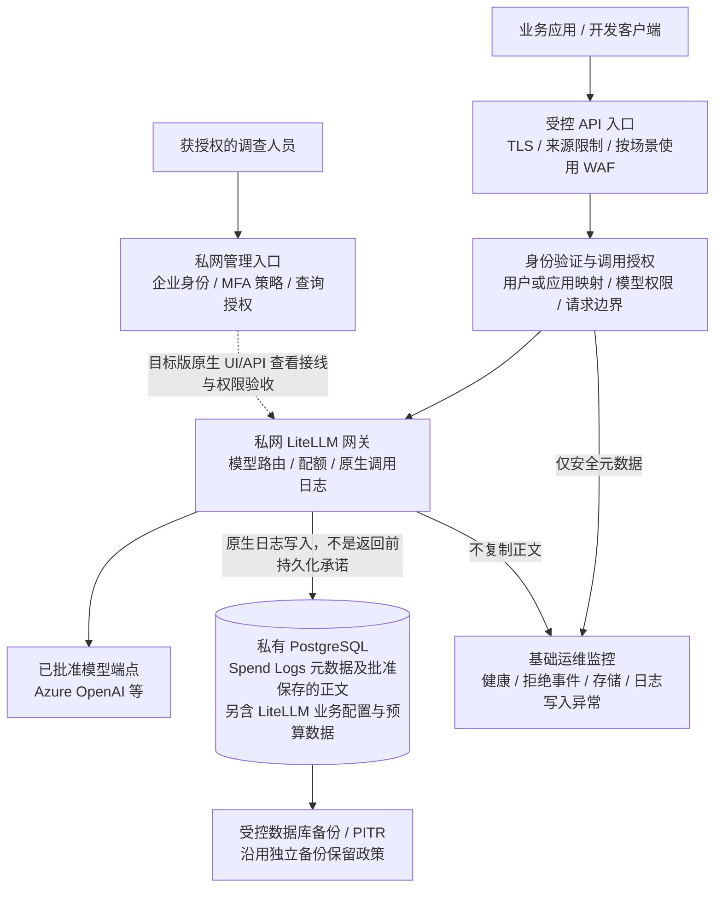

# 安全增强版 LiteLLM 网关：第一阶段内容审计方案

> 客户方案交流稿 | 编制日期：2026-09-09 | 建议汇报日期：2026-09-10
>
> 方案定位：复用 LiteLLM 原生能力，实现受控的内容留痕与事后追溯。本文是建议方案，不是生产验收报告。文中的“第一阶段”指本次基础版交付范围，不等同于工程路线图的 Stage1。

## 1. 核心结论

**第一阶段建议采用 LiteLLM 原生 Spend Logs 保存经批准的请求与响应内容，不将自建全文采集平台作为上线前提。**

LiteLLM 负责记录模型调用；安全增强方案重点解决“谁能调用、谁能查看、内容保存在哪里、保留多久、故障如何发现”。我们不重复开发已有日志能力，也不因为简化内容采集而取消身份、网络、密钥和数据库安全措施。

本阶段面向三个业务问题：

1. 某次模型调用由哪个已认证用户或应用发起，使用了哪个模型？
2. 在批准记录且内容可读的范围内，输入了什么、模型返回了什么？
3. 出现费用异常、输出争议或疑似数据不当使用时，如何限定范围调查并关联记录？

**本阶段不承诺**每个网络字节完整记录、每条日志绝不丢失、日志不可篡改，或自动识别并阻断全部敏感内容。若客户要求这些保证，应另行确认增强审计范围和成本。

### 建议向客户这样介绍

> “我们先利用 LiteLLM 已有的输入输出日志能力，让调用过程具备可追溯性；再通过私网、身份、权限、留存和监控，把这些内容保护起来。基础版不额外建设一套全文采集平台。将来确有独立审批、案件保全或更高可靠性要求时，再按需扩展。”

## 2. 先明确“内容审计”指什么

| 能力 | 含义 | 第一阶段定位 |
| --- | --- | --- |
| 调用元数据记录 | 时间、调用标识、身份关联、模型、Token、费用、状态等 | 保留，作为日常排障和费用追溯基础 |
| 输入输出内容留痕 | 保存 LiteLLM 日志对象中的请求消息和响应内容 | 客户批准后启用原生 Spend Logs 正文存储 |
| 事后内容调查 | 授权人员按调用记录定位内容、分析问题 | 提供受控查询流程；具体 UI/API 权限在目标版本验收 |
| 实时内容检测与拦截 | 对敏感信息、违规内容、Prompt Injection 等作实时判定 | 独立能力，不因启用正文日志而自动获得 |
| 强化合规取证 | 不可变存储、独立原文审批、案件保全、可靠交付证明 | 非本阶段默认项，按明确要求扩展 |

本文的基础版“内容审计”主要是**受控留痕与事后追溯**，不是自动合规判定系统。

网关记录的是流经它的模型请求与模型响应，不是员工电脑的全部活动记录，也不是客户端所有本地工具操作的录屏或日志。未经过网关的模型调用不在覆盖范围内。

## 3. 基础版架构



图中的管理查询路径是交付目标，须完成实际接线和越权测试后启用。普通用户不直接连接数据库，管理接口不因提供日志查询而暴露到公网。

### 与增强审计方案相比，有哪些变化

| 设计点 | 第一阶段基础版 | 可选增强方案 |
| --- | --- | --- |
| 正文采集与存储 | LiteLLM 原生记录，正文存入在线 PostgreSQL | 专用采集/交付层及独立审计存储 |
| 推理响应与日志关系 | 保持原生行为，不额外增加逐分片存储确认门槛 | 经验证后实施“持久化确认后转发”等策略 |
| 原文权限边界 | 私网管理入口、已验证的原生权限和受控管理员角色 | 独立审计读者、细粒度审批与受控原文查询 |
| 留存删除 | 原生 Spend Logs 清理策略，加数据库维护与备份管理 | 独立留存策略、保全登记、删除与恢复协调 |
| 数据库职责 | 控制数据与日志在同一在线数据库，容量与负载共同规划 | 内容与在线控制数据库分离，降低相互影响 |
| 运维复杂度 | 少一套正文存储、恢复和审批服务 | 增加组件、身份、故障恢复和治理流程 |

基础版不默认部署自建 L3 原文分片日志、原文 Blob 库及其恢复/双审批/保全服务。只有原有合规要求允许这种边界时，才能采用基础版；已经明确要求的强审计控制不能未经客户批准直接取消。

**OpenTelemetry collector 与正文审计是两个独立选择。** collector 用于 Trace、耗时关联和遥测转发，保存 Prompt 并不要求它存在。基础版仍保留必要健康检查、入口安全事件和告警，可复用已有运维平台；跨服务 Trace 有明确收益时再选装 collector。普通遥测不重复保存正文。

## 4. 保留哪些既有安全增强

| 安全方向 | 基础版继续保留的设计 | 对内容审计的价值 |
| --- | --- | --- |
| 身份与责任归属 | 企业身份校验，一人/一应用对应独立授权凭据与受信映射 | 避免多人共享身份导致无法追溯 |
| 数据面与管理面分离 | API 仅开放必要路由，管理及内容查询仅限批准私网入口 | 防止“能调用模型”变成“能查看他人内容” |
| 私网与网络隔离 | 数据库、密钥、模型等后端私网访问，工作负载最小网络权限 | 减少绕过网关或直接读取日志库的路径 |
| 工作负载身份与密钥管理 | 使用工作负载身份访问支持的服务；必要秘密进入 Key Vault | 不把数据库凭据、Master Key 或模型密钥写进日志/仓库 |
| 模型与用量控制 | 显式模型授权、预算、速率和并发限制 | 结合日志调查异常用量，不把费用统计当作内容判定 |
| 数据平台 | 数据库 TLS、存储加密、备份/PITR、容量与可用性规划 | 保护保存的内容，并确保日志增长不挤垮网关 |
| 供应链与自动化 | 固定镜像、扫描、审批发布、配置检查和回退流程 | 配置变化可审查，防止无意扩大采集或查看范围 |

这些是需要落地和验收的控制，不代表现有客户环境已经全部具备。网络私有化和存储加密也不等于数据库管理员无法读取内容。

## 5. 记录什么，怎样关联到责任主体

| 信息 | 建议用途 | 必须说明的边界 |
| --- | --- | --- |
| 请求/调用标识与时间 | 定位单次调用、关联故障 | 重试与 fallback 可能对应多个上游尝试，不能简单按行数计算业务请求数 |
| 用户、应用、Key、Team 关联 | 确认责任主体与部门 | 以已认证身份和服务端凭据映射为准，不信任客户端自填的 user/metadata |
| 模型与调用类型 | 确认使用范围 | 模型组、实际部署与供应商字段以目标版本实际记录为准 |
| 请求内容 | 追溯发送给模型的业务输入 | 可能包括历史上下文、系统指令、代码、工具定义及工具结果，不只是最后一句话 |
| 响应内容 | 复核模型输出 | 流式响应可能是汇总结果；可能存在截断、缺失或转换，不是网络逐字节归档 |
| Token、费用、状态、耗时 | 用量统计与排障 | 费用是网关计算口径；成功状态不能单独证明客户端完整收到或日志无缺口 |

### 不承诺保存后即可看到全部明文

- 加密上下文或供应商不公开的内容，保存后也可能仍不可读，不能承诺获取模型内部推理过程。
- 图片、音频、文件和多模态内容可能以引用、编码或部分字段出现；不将 Spend Logs 描述成完整文件归档。
- 认证失败、入口拒绝等尚未进入 LiteLLM 模型调用的请求，通过独立安全元数据记录，不为追责而额外保存未授权请求正文。
- 业务归属标识若采用伪名化，应另行保护其与真实用户的映射；伪名化不等于匿名。

原生正文开关不能直接等同于已经具备“逐部门选择采集”的能力。如果只批准某部分业务，须验证目标版本的受支持选择机制；不满足时采用隔离实例/流量范围，不能先全量收集再依赖查看过滤。

## 6. 谁可以查看内容

**内容查看是单独的数据访问授权，不应自动附带在所有运维或费用查看权限上。**

| 角色 | 建议权限 |
| --- | --- |
| 普通调用者 | 调用批准模型；默认不开放全局 Spend Logs 或他人正文 |
| 日常运维 | 健康、容量、错误与用量元数据；需要读正文时另外授权 |
| 获批准的调查人员 | 在实际可实施的权限边界内查看所需内容，记录工单和调查范围 |
| 数据库管理员/备份管理员 | 属于高权限数据访问者；访问审批、身份审计及导出管控不能忽略 |

基础版优先使用 LiteLLM 的原生查看界面或 API，但**存储正文的能力不等于 OSS 版本已提供独立内容审计员、字段级脱敏、Team 隔离或每次查看审批**。须用选定镜像和实际许可证验证查询接口的读取范围。

若原生权限无法把“查看费用”和“读取正文”分离，第一阶段应仅向经明确批准的有限管理员开放正文查询，不能把该角色包装成最小权限审计员。如果客户不接受这一边界，就必须增加经过验证的受控查询层或使用满足要求的产品能力，不能只靠操作规程代替技术隔离。

常规调查建议按“工单与授权确认 → 限定身份/时间/请求范围 → 查询内容 → 记录调查结论 → 到期回收临时授权”执行。业务/合规负责人可以参与批准，不要求只有一位 IT 运维的客户虚构第二位运维人员。

MFA、登录日志只能证明部分身份访问事实，不能自动证明“某人查看了哪条 Prompt”。原文读取/导出审计须核对目标 UI/API 的实际能力；若只能依赖工单和登录记录，应如实披露。原文不得作为 CI artifact、普通工单附件或群聊截图四处复制。

## 7. 数据保护与留存建议

### 7.1 收集前先批准

明确用途、业务范围、数据地域、内容类型、可查看角色及保留期限。代码、个人信息、业务机密可能随上下文进入日志；日志会增加一份持久副本，并可能进入数据库备份。启用前应完成客户内部告知和必要的数据处理批准。

尽量从数据源避免传入密码、Token 和高敏感业务材料。记录 Prompt 的开关不是 DLP 开关，不承诺自动识别所有秘密。若使用脱敏，需测试脱敏时机与效果，尤其是流式、嵌套工具参数和跨事件内容；不能假定现有自建采集器的脱敏会自动作用于原生 Spend Logs。

### 7.2 建议的试点策略

| 决策 | 建议起点 | 说明 |
| --- | --- | --- |
| 正文存储 | 默认关闭，试点获批后显式启用 | 不因升级镜像或重新部署自动开启 |
| 正文在线保留 | 先评估 7 天作为试点起点 | 最终期限由调查需要、敏感性、容量和客户政策决定 |
| 清理检查 | 定时清理并监控实际执行情况 | 保留期不是到点立即物理清除；清理间隔、失败重试会形成延迟 |
| 费用历史 | 与正文期限分别定义业务需求 | 原生 Spend Logs 行级清理可能同时删除该行元数据；不能假定一个开关支持“正文 7 天、同一行费用明细一年” |
| 数据库备份 | 独立确定保留和恢复访问政策 | 在线删除不会自动擦除现有备份/PITR 中的正文 |
| 长期证据 | 按批准调查另行保存和授权 | 基础版没有按案件暂停指定记录删除的完整保全能力 |

关闭正文记录通常只影响后续调用，不会自动删除此前已保存的内容。数据恢复可能使先前删除的日志重新出现；恢复后应在开放查询前重新校验留存和访问策略。

## 8. 成本、性能与可用性取舍

原生方案减少了专用正文采集服务和存储的建设成本，但**内容存储成本并没有消失，而是主要进入 PostgreSQL、WAL、备份和维护开销**。如果与凭据、预算等数据共库，日志负载可能影响关键控制数据的读写。

粗略容量估算可以先用：

$$
\text{正文基础存储量} \approx \text{每日日志记录数} \times \text{每条输入输出平均字节数} \times \text{保留天数}
$$

例如每天 10,000 条日志、每条平均 100 KB、保留 7 天，原始内容约 7 GB（十进制估算）。此数**不包含**索引、JSON/编码开销、WAL、复制、备份和数据库空闲空间，也不预测压缩效果。Codex 等长上下文客户端会重复发送历史内容，不能以“每天提问次数 × 最后一句话大小”估算。

上线前应比较正文关闭与开启时的延迟、首 Token 时间、错误率、数据库 CPU/IO、存储增长、写日志失败及清理耗时。以真实样本确定容量与告警阈值，不直接套用示例规模。

基础版建议采用“原生异步/批量记录，异常告警和追查”的运行策略，不额外加逐分片持久化确认，但必须验证目标版本在数据库异常时的真实表现。由于数据库还参与认证、预算等功能，不能承诺“日志库出问题完全不影响推理”。

若客户要求“日志失败必须停止推理”，那是另一种明确的可用性/审计取舍，不是启用原生正文开关就可以得到的保证。

## 9. 试点与验收

### 建议实施顺序

1. 确认批准的业务/客户端、可记录内容、查看角色、地域和留存政策。
2. 固定 LiteLLM 版本；核对数据库与 UI/API 权限，基线记录当前容量、延迟和备份策略。
3. 在隔离试点中启用原生日志；有选择性采集要求时先证明选择机制有效。
4. 完成下面的正向、负向与故障测试，并检查真实日志字段而非只看请求状态码。
5. 按约定业务范围放行，启用容量、日志写入异常和清理失败告警；保留关闭后续正文采集的回退路径。

### 必须验证的项目

| 测试 | 通过条件 |
| --- | --- |
| 普通请求留痕 | 请求与响应字段可关联到可信身份、模型和调用标识；缺失字段有明确解释 |
| 流式及异常请求 | SSE、上游错误、客户端取消、提前断流分别检查实际记录，不把成功标签误当完整性证明 |
| 实际首发客户端 | Codex 的实际版本、HTTP/WS、多轮与加密上下文逐项测试，记录明文可见性和覆盖缺口 |
| 大上下文与工具调用 | 长 Prompt、工具参数/结果及截断行为符合批准范围；不承诺保留全部二进制文件 |
| 查询权限 | 普通用户/不相关主体无法读取其他人的正文；管理入口在公网不可访问 |
| 禁止客户端关闭记录 | 检查 no-log、日志相关 Header、metadata 等覆盖路径；调用者不能绕过管理员采集政策 |
| 敏感内容 | 合成秘密/个人信息验证保存范围及脱敏效果；普通日志、Trace、artifact 不复制正文 |
| 留存与备份 | 清理实际执行且可监控；权限、导出、备份残留和恢复后重现的处理有明确政策 |
| 写入故障 | 模拟日志写入失败、进程退出、数据库连接问题；观测丢失/延迟和业务影响，不签发零丢失结论 |
| 容量与回退 | 实测日志增长与查询/写入负载；关闭后续采集不破坏凭据、预算或历史数据 |

部署与检查的交付目标仍是 workflow 自动执行，客户负责信息、授权和变更决策，不负责编写 YAML、SQL、检查脚本或哈希。部分自动化仍需调整实现，不能把这个交付目标描述为当前已经全部完成。

## 10. 什么情况下再升级

只有出现下列明确需要时，再评估增强审计，而不是把它作为所有客户的默认负担：

- 业务规定必须确认内容持久化后才能继续返回结果。
- 要求内容与业务控制数据库隔离，或正文体量已明显影响在线服务。
- 需要独立审计读者、逐次原文审批、细粒度访问/导出留痕。
- 需要按案件保全、不可变留存、独立密钥或更强的数据管理员隔离。
- 要求模型尝试、重试/fallback、传输结束、客户端接收和持久化结果分别有证据。

届时优先评估原生受支持配置、适合的产品能力或轻量适配，再决定是否自建。独立 Blob 库、自定义回调或 collector 本身都不天然意味着不可篡改或零丢失；任何增强保证也必须通过故障和权限验收。

## 11. 本次会议建议确认的五项决策

1. **目的**：是否同意第一阶段以事后追溯为目标，不把实时拦截、零丢失或强取证作为隐含承诺？
2. **范围**：哪些用户/应用/客户端、哪些内容允许记录？是否包含源代码、历史上下文和工具参数？
3. **权限**：谁可以读正文，谁批准调查？是否接受经过验证的有限管理员查看边界？
4. **期限**：在线正文保留多久，备份保留多久，是否存在必须暂停删除的案件保全要求？
5. **故障策略**：是否接受原生日志可能延迟、截断或存在缺口，通过告警处理？还是要求日志不可用时停止服务？

如果这些决策与基础版边界一致，建议先交付并验收原生内容留痕，把资源投入到安全访问、可用性和自动运维。若不一致，应在上线前明确增强范围，而不是后期用“已打开日志”补充解释。

---

## 附录 A：技术核验与当前实现状态

本附录供技术答疑，区别于前文客户方案建议。

### A.1 已确认的原生能力

项目固定 LiteLLM `1.98.0` 镜像摘要为：

```text
sha256:20b5044b619055374061a6d5b7b08754cad75aeabbf82ddf4f69cc0cf80ddaf4
```

对该镜像只读源码核对确认：存在 `store_prompts_in_spend_logs` 配置，描述为保存请求消息和响应；日志实现检查该配置及同名环境变量，并存在批量写入和正文截断保护路径。这是配置/源码事实，**不是所有协议的完整落库实测，也不是目标 UI/API 权限或生产部署验收**。

实际启用时须核对 YAML、数据库配置覆盖、环境变量、消息日志开关及客户端覆盖参数的一致性。特别是环境变量可能独立启用正文记录，不能只检查一处 YAML。不同 LiteLLM 版本、接口和许可证的字段、可见性和日志功能必须以目标版本实测为准。

### A.2 与当前仓库的差异

- [当前默认配置](../deploy/base/config.yaml)仍是 `store_prompts_in_spend_logs: false`，且已有静态门禁要求正文关闭。本文没有修改这个默认值，也没有开启客户日志。
- [认证代理](../auth-proxy/README_ZH.md)目前没有开放原生 `/ui` 和 Spend Logs 查询路由；不能仅打开正文记录开关就宣称“管理员已能在私网界面查看”。基础版需要补齐受控查看路径与权限回归，不能原样开放全部管理端点。
- 当前部分身份绑定要求自建 L3 采集。切换为基础版时须显式调整采集模式、发布生成器与验收项，避免原生记录已开而代理仍因自建 L3 未启用拒绝请求，也避免无意双份落正文。
- [此前 L3 路线](litellm-oss-callback-validation-2026-09-07.md)按增强审计设计。基础版确定后，需要将专用采集、恢复和治理组件改为可选，并更新成本及阶段依赖；不能直接删除日志组件而留下冲突门禁。
- 当前代理仍有 Codex/WS 等协议限制；改用原生 Spend Logs 不会自动解决客户端兼容问题。本次不把尚未完成的兼容改造从上线条件中移除。

### A.3 建议对实现进行的调整

保留安全入口、身份映射、私网和数据平台；新增明确的原生日志模式与配置检查，关闭该模式下的自建正文采集。补受控查询、原生字段/权限测试、容量与清理监控，把增强审计从基础版必经阶段中解耦。保留运维遥测选择，不默认把正文送往多个平台。

这些是后续改造事项。当前客户部署、数据库写入、权限放行、日志采集和云端资源均未因本汇报稿发生变化。

### A.4 技术参考

- [LiteLLM Logging](https://docs.litellm.ai/docs/proxy/logging)：消息日志、回调和 OpenTelemetry 等能力；其中部分连接器/授权能力有许可证边界。
- [LiteLLM Spend Tracking](https://docs.litellm.ai/docs/proxy/cost_tracking)：用量、调用记录与查询接口；不将最新网页描述自动等同于已部署镜像行为。
- [LiteLLM 配置参考](https://docs.litellm.ai/docs/proxy/config_settings)：配置字段及版本相关说明。
- [项目数据库容量与留存说明](../LiteLLM/POSTGRESQL_CAPACITY_AND_SPEND_LOG_RETENTION_ZH.md)：已有版本的容量和保留策略经验，不将其中历史命令视为当前客户可直接执行的指令。

## 附录 B：建议讲解顺序（约 10 分钟）

| 时间 | 讲解重点 |
| --- | --- |
| 1 分钟 | 先讲结论：原生能力留痕，安全增强保护内容，不重复造采集平台 |
| 2 分钟 | 用架构图解释内容进入数据库、私网查看和必要监控；collector 并非 Prompt 存储前提 |
| 2 分钟 | 说明能查到什么、不能保证什么，尤其是 Codex 上下文、截断和故障缺口 |
| 2 分钟 | 说明正文查看权限、7 天试点建议与备份残留，不把存储加密等同于授权隔离 |
| 2 分钟 | 说明容量、异常告警与试点验收；增强审计按要求再扩展 |
| 1 分钟 | 请客户确认目的、范围、权限、期限和故障策略五项决策 |