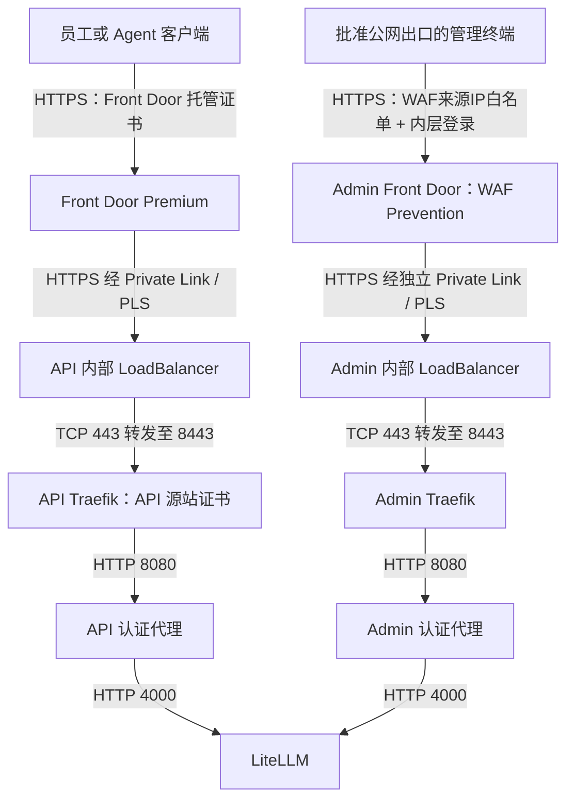
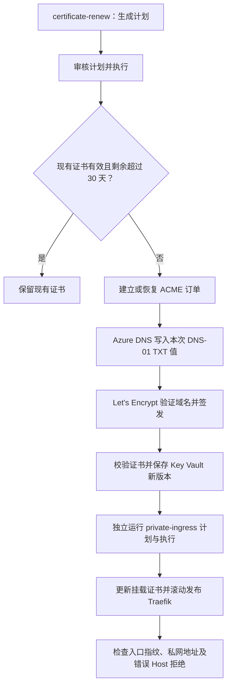

# LiteLLM 入口与 TLS 证书设计说明

> 核对日期：2026-09-23
>
> 适用范围：安全增强版新目标环境的托管部署路径，适用于新建环境及从旧环境迁移。
>
> 文档性质：解释当前代码设计、运维流程及尚未完成的闭环；不代表客户环境已部署、验收或具备生产切流条件。

## 1. 结论与适用边界

新目标环境采用 **Traefik 文件配置入口 + 独立 workflow 中的 Python ACME 客户端 + API 源站使用 Let's Encrypt + Key Vault 保存证书材料**，替代旧部署路径中的 **ingress-nginx + cert-manager** 组合。

需要准确区分：

- Traefik 不运行内置 ACME resolver，只读取已经发布的路由和证书文件。
- Python ACME 客户端负责 API 源站证书的 DNS-01 申请与续期；它不是常驻 Kubernetes 控制器。
- Front Door 对外证书由 Azure 托管，与 API 源站证书独立。
- 管理入口读取企业提供的证书，不进入当前 Let's Encrypt 自动申请流程。
- 仓库仍保留旧部署代码及其他静态入口模板；不能据此认为所有路径都已迁移到 Traefik。新路径不会自动卸载旧环境的 NGINX 或 cert-manager。

这里讨论的是 TLS 服务端身份验证和传输加密。员工或 Agent 的访问身份、模型权限与预算属于另一个控制层，不由证书签发替代。

## 2. 组件职责与旧方案对照

| 职责 | 旧方案 | 当前托管新环境方案 |
| --- | --- | --- |
| HTTPS 终止与请求转发 | ingress-nginx | API、admin 各自独立的 Traefik Deployment |
| 路由配置来源 | Kubernetes Ingress 资源 | workflow 生成 ConfigMap，Traefik file provider 读取挂载文件 |
| 证书生命周期协调 | cert-manager 控制器 | workflow 调用独立 Python 证书操作 |
| 自动申请协议 | cert-manager 可使用 ACME | Python 客户端使用 ACME |
| API 源站签发机构 | 取决于旧 Issuer 配置 | 当前自动申请路径固定为 Let's Encrypt 生产目录 |
| 域名控制权验证 | 取决于旧 Issuer 配置 | Azure DNS 上的 DNS-01 TXT 验证 |
| 证书持久保存 | 通常由 cert-manager 管理 Kubernetes Secret | PEM 证书链和私钥先存入 Key Vault Secret，再发布到 Kubernetes TLS Secret |
| 入口换证 | 通常由控制器协调更新 | 独立执行 `private-ingress`，校验并滚动更新入口 |

**ACME 是协议，Let's Encrypt 是 CA，Traefik 是反向代理，cert-manager 是证书控制器。** 当前并不是用其中某一个组件单独替代其余全部职责。

Traefik 的版本和 digest 以[入口镜像锁定文件](../deploy/private-ingress-image.json)为准，发布路径将固定镜像引入批准的 ACR，不使用浮动 `latest`。

## 3. 三类TLS服务端证书与Admin来源门禁

上图描述启用 Front Door 后的目标流量路径。API、Admin分别使用`llm-api.<baseDomain>`和`llm-admin.<baseDomain>`，但绑定不同endpoint、WAF、route、PLS和内部LB。Admin域公网可解析，Admin WAF固定在Prevention模式，仅允许`adminAllowedCidrs`声明的实际公网出口，随后仍须通过Entra或LiteLLM原生登录。

| TLS 连接 | 服务端出示的证书 | 信任与生命周期责任 |
| --- | --- | --- |
| API/Admin客户端到各自Front Door endpoint | Azure Front Door托管服务端证书 | Azure管理边缘服务端证书；客户仍须完成两个域名验证和DNS配置 |
| Front Door 到 API Traefik 源站 | API 域名证书，自动路径由 Let's Encrypt 签发 | workflow 签发、存储、发布；证书须满足 Front Door 源站验证要求，保持主机名、SNI、证书链一致 |
| Front Door到Admin Traefik源站 | Admin域名的公有CA证书 | 根必须在Microsoft Trusted CA List中，完整链和SAN匹配；内部CA/自签名不受支持。当前由客户手工提供，workflow仅发布和验证 |

Admin来源IP白名单不是TLS客户端身份认证。共享NAT后的主体都会通过同一个外层门禁，必须继续依赖内层登录、强凭据、限流与审计；出口不稳定时应先使用可控企业代理/VPN出口或重新选择身份感知边缘方案。

入口发布器可以读取外部准备好的API/Admin源站证书。当前自动ACME只覆盖API；Admin源站也必须由Microsoft信任列表中的公有CA签发，不能继续使用仅安装到Runner或管理浏览器的企业私有CA来回源。

## 4. 设计理由与取舍

当前应用只有明确分离的 API 与管理入口，路由和后端服务由受控配置生成，不需要入口控制器动态发现任意应用 Ingress。

1. **收窄入口 Pod 权限。** Traefik 不启用 Kubernetes Ingress/CRD provider，也不需要监听应用 Secret；ServiceAccount 不自动挂载 Kubernetes API Token。
2. **区分签发与发布权限。** 证书操作使用专用 workflow 身份处理 DNS 和 Key Vault；Traefik 不持有 ACME 账户、DNS 修改权限或 Key Vault 访问凭据。
3. **保留可审查的发布边界。** 计划绑定代码版本、配置、证书版本及指纹，执行时重新核对，再验证实际入口证书。
4. **隔离 API 与管理面。** 两套入口拥有独立命名空间、证书、路由、内部负载均衡地址和来源限制。

代价是项目必须维护证书申请状态、续期调度、发布协调及失败处理。cert-manager 已提供成熟的持续协调能力，当前 workflow 实现还没有覆盖这些能力的全部生命周期。

这是一项针对固定入口和受控发布需求的取舍，**不是 Traefik 天然比其他入口安全，也不是 cert-manager 不支持私网或 DNS-01**。若未来需要大量域名、多租户动态路由或常驻自动续期，应重新评估成熟证书控制器的维护成本与权限边界。

## 5. API 证书申请与续期

实现入口为[证书操作模块](../scripts/certificate_runtime.py)，由[私网运行操作 workflow](../.github/workflows/customer-runtime.yml)的 `certificate-renew` 动作调用。

当前约束包括：

- ACME 目录固定为 `https://acme-v02.api.letsencrypt.org/directory`，不是通用多 CA 或 staging 切换接口。
- `certificates.zoneResourceId` 必须指向批准订阅中覆盖 API 域名的 Azure DNS 公共区域；当前没有其他 DNS 厂商适配器。
- 必须显式接受 CA 条款及公共证书透明度披露，即 `termsAccepted=true`、`publicApiHostnameAccepted=true`。
- 自动续期需要不带版本号的 `privateIngress.api.tlsSecretId`；API 与 admin 的证书引用必须分开。
- ACME 账户、待签发私钥、CSR 与订单状态保存到批准的 API Key Vault；当前写入的是 Secret 对象，不是 Key Vault Certificate 生命周期策略。
- DNS 修改以 ETag 条件更新，添加或移除本次挑战的准确 TXT 值，保留其他值及记录属性；失败后仍需检查残留状态，不能宣称任何异常都会自动清理。
- 现有证书有效且剩余超过 30 天时保留；对无法校验且没有本 workflow 管理标记的证书，拒绝自动替换。
- 新证书写入新 Secret 版本，保留旧版本；签发结果中的 `ingressUpdated=false` 明确表示入口尚未更新。

DNS-01 用公共 DNS TXT 证明域名控制权，不要求私有源站开放公网 80 端口，也不依赖 API 域名的 A/CNAME 将挑战请求送到源站。runner 仍需具备访问 Azure 服务和 ACME 服务的批准网络路径，且 DNS 验证记录必须对公共 CA 可见。

公开 CA 签发可能暴露证书中的域名。管理入口选择企业证书是当前的隐私和治理策略，**并非 Let's Encrypt 在技术上不能为私网服务的公开域名签发证书**。

## 6. 证书发布与 Traefik 运行方式

实现见[入口生成器](../scripts/private_ingress.py)和[入口发布模块](../scripts/private_ingress_runtime.py)。

`private-ingress` 对 API 和 admin 两个入口统一生成计划并校验：

1. 从批准的 Key Vault Secret 读取 PEM 证书链与未加密私钥，校验主机名、用途、私钥匹配及有效期；加载时要求至少剩余 7 天，并使用固定版本`certifi`公有根证书包执行OpenSSL信任链检查，不继承Runner额外安装的企业或测试CA。该预检用于拒绝私有/自签链，Front Door的Microsoft信任列表仍是最终回源判据。
2. 将具体 Secret 版本、证书指纹、代码版本、配置与现有受管对象状态绑定到计划，执行前重新核对，拒绝未经批准的状态变化及接管非本流程管理的资源。
3. 创建不可变 Kubernetes TLS Secret，名称为 `llm-<plane>-ingress-tls-<证书指纹前16位>`，挂载为 `/certs/tls.crt` 和 `/certs/tls.key`。
4. 发布文件路由配置和 Deployment。证书 Secret 名称及 Pod 模板指纹变化触发滚动更新，而不是依赖 Traefik 自行从 Key Vault 拉取新版本。
5. 等待入口就绪，检查实际内部负载均衡地址、批准子网、TLS 证书指纹及错误平面 Host 拒绝；API 与 admin 必须使用不同的私网地址。

每个入口默认两副本，配有 PDB 和拓扑分散配置；这不自动等于跨可用区容灾。Traefik 在 Pod 内监听 HTTPS 8443，由内部 LoadBalancer 的 443 端口转发；最低 TLS 版本为 1.2，启用严格 SNI，关闭 dashboard 和访问日志。

来源 CIDR、命名空间隔离及 NetworkPolicy 限制访问路径，但不能替代应用认证。发布结果包含的资源回执或 `verified` 标记，也不代表整个迁移阶段已验收。

## 7. TLS、应用认证和私钥边界

| 控制 | 当前行为 | 不能据此宣称的能力 |
| --- | --- | --- |
| TLS 服务端验证 | 客户端或 Front Door 验证其连接对端的服务端证书 | 没有因此实现客户端证书认证或 mTLS |
| API 身份与授权 | 认证代理要求企业 Entra Token 和客户端提供的 LiteLLM vkey；模型权限、预算由 LiteLLM 决定 | 服务端 TLS 证书不代表员工身份，也不能取代 Token 或 vkey |
| 管理入口认证 | Front Door WAF先限制批准公网出口，私网回源后仍需OIDC或LiteLLM原生登录 | 来源IP不是用户身份，共享NAT内的任意主体不会因此自动获得管理员权限 |
| 私钥存储 | Key Vault 持久保存，发布时产生 Kubernetes TLS Secret 副本并挂载到入口 Pod | 不是私钥从不离开 Key Vault，也不是 HSM 内不可导出的 TLS 私钥方案 |
| 集群内传输 | Traefik 到认证代理使用 HTTP 8080，认证代理到 LiteLLM 使用 HTTP 4000 | 不是客户端到 LiteLLM 的全链路 TLS 或 Pod 间 mTLS |

NetworkPolicy 提供网络访问隔离，不为 HTTP 内容加密。若客户要求集群内传输加密，需要另行设计后端 TLS 或服务网格等方案，并验证证书信任、流式响应及相关协议；当前文档不代表这些能力已经实现。

应限制 runner、Key Vault 和 Kubernetes Secret 的读取权限，不将 PEM、私钥、ACME 账户材料或真实客户配置放入 Git、日志及 workflow artifact。证书版本和指纹可用于计划核对，但元数据本身不是私钥保护措施。

## 8. 运维顺序、失败处理与当前缺口

对于已满足相关阶段前置条件的环境，使用 GitHub Actions 的 `Customer private runtime operations` 工作流。具体环境保护、计划引用与执行前置条件以[部署与迁移 workflow 指南](customer-deployment-workflows-zh.md)为准，不能绕过阶段门禁直接执行。

| 场景 | 操作顺序 | 完成判据 |
| --- | --- | --- |
| 首次使用自动 API 证书 | 确认域名、DNS 权限、条款及管理证书；`certificate-renew` 计划、审核、执行；再运行 `private-ingress` 计划、审核、执行 | Key Vault 保存成功，实际入口证书和私网地址检查成功；接入 Front Door 后继续验证源站 TLS 和真实客户端 |
| API 证书续期 | 运行 `certificate-renew`，确有新版本时再运行 `private-ingress` | 以实际提供服务的证书指纹和有效期为准，而非仅检查 Key Vault 最新版本 |
| 管理证书更新 | 企业 PKI 准备新证书并更新批准的 Key Vault 引用或版本，再运行 `private-ingress` | runner 和管理客户端信任新链，私网管理入口及实际登录验证通过 |
| 外部提供 API 证书 | 将符合要求的证书保存到批准的 Key Vault，再运行 `private-ingress` | 入口发布校验及 Front Door 源站验证均通过；外部流程负责后续续期 |

如果引用固定 Secret 版本，新版本不会被该引用自动选中；自动 API 续期则要求使用无版本引用。无版本引用也不意味着已运行 Pod 自动换证，仍需发布。

失败处理原则：

- 签发或写入状态不确定时保留 Key Vault 中的待处理状态，查明问题后重新计划；不要盲目反复下单、删除账户或清空订单状态。
- 新证书已写入但发布失败时，分别核实 Key Vault 版本和当前入口证书，不能将其报告为续期闭环成功。
- 计划与现状不一致时重新计划和审核，不强行沿用旧批准。变更涉及的阶段及后续证据需按现有门禁重新评估。
- 旧证书版本保留不等于自动回退。回退需要确认旧证书仍有效且未泄露、未撤销，并走重新审核的发布流程；当前没有专用的一键证书回退动作。
- 不因源站 TLS 失败而关闭证书验证、开放原本私有的源站，或临时公开管理入口。

**截至本次核对，代码提供了按需签发与按需发布，但没有完整的定时续期、自动换证、失败通知和全部异常订单协调闭环。** 运维仍需明确证书负责人、到期检查与更新窗口，并分别监测边缘证书、API 源站证书和管理证书。不能将“申请功能可运行”写成“无人值守续期已完成”。

## 9. 迁移与验收要求

新入口部署不自动改变旧生产环境。迁移时保留旧 ingress-nginx、cert-manager、证书与入口，直至新路径完成批准的验证、切流及回退检查，再单独批准旧资源退役。避免在同一域名、DNS 记录或证书 Secret 上安排未经协调的多个写入者。

至少验证以下内容，并保存不含凭据的实际运行证据：

- DNS-01 签发和重复执行行为正确，不覆盖其他 TXT 值；受限网络中的 runner 能完成所需调用。
- API 与管理证书主机名、用途、信任链和有效期正确；不受信任证书、错误主机名及错误入口 Host 被拒绝。
- 更新后，实际提供服务的证书指纹与批准版本一致，入口 rollout 和长连接、SSE 等客户必需协议满足要求。
- 两个Front Door边缘证书及两份私有源站TLS分别通过验证；两条PLS连接经过批准，Admin白名单外来源被WAF拒绝，白名单内来源仍须通过内层登录，错误密码不得放行。
- 真实 API Token 与 vkey 认证、管理登录和来源隔离通过验证，不能仅靠匿名拒绝测试宣布业务可用。
- 证书即将到期、签发失败、Key Vault 写入失败、发布失败、CA 信任链变化及可行回退都有明确处理责任和验证结果。

本地单元测试、容器测试和计划校验只能证明对应的代码行为。客户 Azure DNS、Key Vault、Private AKS、Front Door、企业信任链和实际客户端仍须在获得授权的环境中完成验收。

## 10. 实现与延伸阅读

- [Traefik 镜像版本及 digest](../deploy/private-ingress-image.json)
- [入口路由、TLS 与隔离配置生成](../scripts/private_ingress.py)
- [Key Vault 读取、证书发布与入口验证](../scripts/private_ingress_runtime.py)
- [ACME DNS-01 与证书状态管理](../scripts/certificate_runtime.py)
- [私网运行操作 workflow](../.github/workflows/customer-runtime.yml)
- [Front Door 边缘证书与私有源站配置](../infra/edge/main.bicep)
- [部署与迁移 workflow 指南](customer-deployment-workflows-zh.md)
- [认证代理说明](../auth-proxy/README_ZH.md)
- [旧版部署实现，非本设计的托管入口路径](../LiteLLM/deploy_mi_aks_litellm.py)