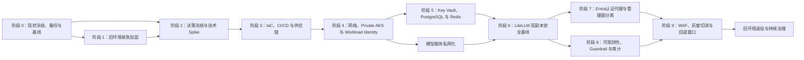

# LiteLLM 网关安全增强推荐改造路径

> 文档状态：实施路线建议稿  
> 编制日期：2026-09-01  
> 输入文档：`docs/litellm-azure-security-hardening-zh.md`、`docs/litellm-security-hardening-change-list-zh.md`、`docs/litellm-bom-cost-comparison-zh.md`  
> 当前基线：LiteLLM `1.95.0`、公网 ingress-nginx、节点级 Managed Identity、AKS 内单副本 PostgreSQL  
> 目标：在不破坏当前已验证业务能力的前提下，通过新建安全生产环境、数据迁移和灰度切流完成企业级安全增强  
> 明确边界：本路线不引入 Azure API Management（APIM）

## 当前完成度澄清（2026-09-07）

客户执行入口为[分阶段迁移指南](customer-migration-guide-zh.md)及Customer staged migration workflow；真实配置从客户GitHub Environment注入。以下阶段记录已去标识化，只是参考实施证据，不是客户已完成的准备或部署状态。

阶段0至9已有阶段性交付，**全部编码、IaC集成和生产验收尚未完成**。阶段9仍为切流准备，不是已切流；模板存在或离线门禁通过不代表云端接线完成。

2026-09-10审计范围已调整为原生Spend Logs基础版，自建L3可靠交付仅作为可选增强分支；[原收尾台账](litellm-code-completion-backlog-2026-09-07.md)中的L3默认前提不再普遍适用，其他身份/协议/数据/入口验收不取消。固定LiteLLM `1.98.0`的[OSS回调实测](litellm-oss-callback-validation-2026-09-07.md)保留为增强分支历史证据，不代替原生正文落库测试。基础版尚需生成配置、受控查询、容量/清理/备份和模式化阶段门禁，详见[部署指南](customer-deployment-workflows-zh.md)。

本轮未部署、未改DNS/生产流量、未采集生产原文、未提交Git；不使用LiteLLM Enterprise或APIM。

## 1. 文档目的

本文将安全增强方案中的 SEC-01 至 SEC-21 工作包，以及 D01 至 D22 架构决策，整理为具有依赖关系、阶段门槛和回退要求的推荐实施路径。

本文回答以下问题：

1. 哪些工作必须最先完成；
2. 哪些能力应在旧环境止血，哪些应在新环境建设；
3. 网络、身份、数据、LiteLLM、Guardrail、审计和入口之间如何排序；
4. 每个阶段达到什么条件后才能进入下一阶段；
5. 何时允许生产切流，以及如何保留回退能力。

说明：当前工作包编号为 SEC-01 至 SEC-21，共 21 项；D01 至 D22 是 22 个实施前决策项，并非 SEC-22。

## 2. 总体策略

推荐采用“双轨、分层、门禁式”改造：

### 2.1 双轨

- **旧环境轨道**：仅做紧急止血、备份、监控和必要安全加固，继续作为功能基线和回退环境；
- **新环境轨道**：通过 IaC 建设安全生产环境，完成私网、身份、托管状态服务、双副本 LiteLLM、WAF、Guardrail 和审计能力。

### 2.2 分层

```text
Azure 平台层（IaC）
  网络 / Private AKS / WAF / Private Endpoint / Private DNS
  Key Vault / PostgreSQL / Redis / ACR / Monitor / Defender

Kubernetes 平台与应用层
  ServiceAccount / Workload Identity / NetworkPolicy
  Deployment / Service / PDB / HPA / Probes / SecurityContext

LiteLLM 逻辑配置层
  Models / Router / Team / Budget / OSS Guardrail / Logging

独立身份与策略层
  客户自有 Entra 认证代理 / App Roles / Team 映射 / 管理路径隔离
```

### 2.3 门禁式推进

每个阶段必须完成规定的验证、证据和回退准备后，才能进入下一阶段。不得因资源已经创建，就跳过兼容性、故障和恢复验证。

### 2.4 核心顺序

```text
保住数据与回退能力
  -> 冻结架构决策和目标版本
  -> 建立 IaC 与供应链
  -> 建设私有网络、AKS 和身份
  -> 建设 Key Vault、PostgreSQL 和 Redis
  -> 部署 LiteLLM 双副本安全基线
  -> 接入授权、Guardrail、日志与审计
  -> 接入 WAF、灰度切流
  -> 保留回退窗口后退役旧环境
```

## 3. 关键依赖关系



关键依赖原则：

- 先备份并证明可恢复，再迁移数据库或变更 Salt；
- 先验证 Workload Identity，再移除 VMSS 业务 UAMI；
- 先验证 Private Endpoint 和私网 DNS，再禁用模型服务公网访问；
- 先建立日志质量和统一 Trace ID，再建设 Sentinel 检测；
- 先证明协议级 Guardrail 覆盖，再启用强制阻断；
- 先完成内部应用和长连接回归，再将 WAF 切换到 Prevention；
- 先完成目标版本兼容性验证，再执行数据库 schema migration 和生产升级。

## 4. 阶段 0：现状冻结、备份与回退基线

**关联工作包**：SEC-01、SEC-19、SEC-20  
**目标**：确保任何后续改造失败时，数据、密文和已验证能力均可恢复。

### 4.1 主要任务

1. 盘点当前 Azure 订阅、资源组、区域、AKS、DNS、入口、UAMI、模型资源和角色分配；
2. 导出当前 LiteLLM 模型、Router、Team、Virtual Key、预算、SSO、Guardrail 和关键配置；
3. 执行 PostgreSQL 逻辑备份，并恢复到隔离环境；
4. 确认当前 Master Key、实际加密 key 与 Salt 的关系；
5. 对数据库密文做不输出明文的可读性基线验证；
6. 记录当前 LiteLLM `1.95.0` 镜像 digest、配置和 Kubernetes 清单；
7. 保存 Chat、Responses、WebSocket、Codex 多轮、Prompt Cache、SSO 和 Virtual Key 的当前回归结果；
8. 复跑真实 Codex/Agent 多轮基准，记录缓存率、后端切换、429、TTFT 和完成率；
9. 建立变更冻结和紧急变更审批机制。

### 4.2 必需交付物

- 当前资源与身份清单；
- 数据流和信任边界初稿；
- PostgreSQL 备份及隔离恢复报告；
- Salt/密文可读性验证报告；
- 当前镜像 digest 与配置快照；
- 当前功能和性能基准；
- 回退责任人、执行步骤和时间目标。

### 4.3 阶段门槛

- PostgreSQL 备份已证明可恢复；
- UI/数据库配置及密文对象仍可读取；
- 已知当前有效 Master Key、Salt 和回退版本；
- 当前业务基准已有可比较的测试证据；
- 未在 Git、日志或普通备份中保存真实凭据和解密内容。

## 5. 阶段 1：现有环境紧急加固

**关联工作包**：SEC-05、SEC-07、SEC-08、SEC-10、SEC-14、SEC-16、SEC-19  
**目标**：在新环境建设期间降低当前 PoC 环境的高风险暴露，但不进行高风险原地重构。

### 5.1 推荐改造

1. 固定并安全保存永久 `LITELLM_SALT_KEY`，与 Master Key 轮换解耦；
2. 固定 Master Key，禁止部署脚本重复生成或无意覆盖；
3. 维持 PostgreSQL PVC 容量治理，禁止缩容；
4. 保持 Spend Logs 默认保留 `7d`、清理间隔 `1d`；
5. 保持 `store_prompts_in_spend_logs=false`；
6. 为 PostgreSQL 配置容量、inode、WAL、checkpoint、recovery loop 和数据库可用性告警；
7. 为 LiteLLM 和 PostgreSQL 增加合理的 probes、资源 requests/limits 和基础告警；
8. 将当前 LiteLLM `1.95.0` 镜像固定为已验证 digest；
9. 完成 Entra SSO App Role、管理员 MFA 和最小管理员组；
10. 临时通过 ingress allowlist、企业网络或其他批准控制限制 Admin UI；
11. 建立 PostgreSQL、Secret、Salt 和配置恢复 Runbook。

### 5.2 旧环境不建议实施的变更

- 不原地改造成 Private AKS；
- 不原地更换 CNI/Cilium 网络模式；
- 不在未验证 Workload Identity 时移除节点身份；
- 不在同一变更窗口同时升级 LiteLLM、迁移数据库、改变 Router 和切换入口；
- 不启用默认全量 Prompt/Response 原文审计；
- 不将安全增强组件的目标设计误报为已部署状态。

### 5.3 阶段门槛

- Salt、Master Key 和数据库备份均有受控恢复路径；
- PostgreSQL 容量和数据库可用性已有告警；
- Admin UI 暴露范围已收敛；
- 当前镜像已固定 digest；
- 当前环境仍可完成既有功能回归。

## 6. 阶段 2：决策冻结与技术 Spike

**关联工作包**：SEC-01、SEC-05、SEC-07、SEC-08、SEC-09、SEC-13、SEC-15、SEC-16、SEC-21  
**目标**：在创建生产资源前关闭会影响总体架构的未决问题，并证明关键技术兼容性。

> 2026-09-03更新：LiteLLM原生JWT已确认属于Enterprise付费能力，正式排除出本方案。数据面Entra认证改由客户自有、部署在AKS中的独立认证代理实现；方案不得依赖LiteLLM Enterprise许可证。阶段2原始Spike结论保留为排除该能力的证据。

### 6.1 必须冻结的架构决策

| 决策范围 | 推荐默认 |
| --- | --- |
| 公网或内网入口 | 按真实客户端位置选择，不同时建设两套主入口 |
| 互联网入口 | Azure Front Door Premium + WAF + Private Link 私有源站 |
| 纯内网入口 | 内部 Application Gateway WAF v2 |
| Admin UI | 独立内网域名 |
| 数据面身份 | 客户自有Entra认证代理验证JWT；后端使用按身份映射的受限Virtual Key，不启用LiteLLM原生JWT |
| 模型配置事实源 | 生产模型、Router 和安全基线优先 Git；Team、Key、预算使用数据库；Secret 使用 Key Vault |
| IaC | Bicep 或 Terraform 二选一，并成为 Azure 资源唯一事实源 |
| Prompt/Response 落盘 | 默认禁止，例外按治理审批 |
| PG/Redis 认证 | 优先 Entra，兼容性不满足时使用 Key Vault 托管凭据 |
| Guardrail 故障策略 | 按数据分类；高敏请求 fail-closed |
| RTO/RPO | 由客户业务 Owner 批准 |
| 迁移方式 | 推荐新集群迁移，不做大规模原地改造 |
| 内容留痕与增强审计 | 基础版原生Spend Logs经批准后启用，明确PG容量/留存/备份/读取者；独立L3存储与审批按需选择，代码门禁待适配 |
| LiteLLM 版本 | 固定精确版本与 digest，不使用浮动 `latest` |

### 6.2 LiteLLM 版本策略

- 当前生产/回退环境继续固定 `1.95.0`；
- 非生产候选环境优先验证 `1.98.0`；
- 设计冻结时选择通过全部门禁的精确版本；
- 不自动追随最新版本，不使用浮动 Tag；
- 升级前必须验证数据库 schema、Prisma、密文、协议、Router、管理SSO、OSS Guardrail 和 callback；
- 不采购或依赖LiteLLM Enterprise能力；任何仅在Enterprise提供的认证、授权、Guardrail或审计能力必须由Azure原生服务、客户自有组件或OSS能力替代。

### 6.3 优先技术 Spike

1. LiteLLM `1.98.0` 与当前数据库对象、密文和 Prisma schema 的兼容性；
2. Flexible Server `sslmode=verify-full`、TLS CA、连接池和 schema migration；
3. PostgreSQL 密码认证和 Entra token 认证的实际兼容性；
4. Azure Managed Redis TLS、证书、端口、Entra token 首次认证与刷新；
5. Workload Identity 调用 Azure OpenAI/Foundry；
6. 独立Entra认证代理在Chat、Responses HTTP/WebSocket、SSE、Embeddings、Files和MCP/Tools上的统一授权与Header反伪造；
7. Guardrail 在流式、WebSocket、SSE、Files 和 tool-call 路径上的覆盖；
8. `encrypted_content_affinity`、`previous_response_id`、session affinity 和跨 Pod Redis 状态；
9. `prompt_cache_key`、`prompt_cache_breakpoint` 和 usage 字段透传；
10. 审计 callback 对 Responses、WebSocket 和工具链的完整性与失败行为。

### 6.4 阶段门槛

- D01 至 D22 均有 Owner、结论或明确阻塞状态；
- 目标LiteLLM精确版本和OSS能力边界已形成候选结论；
- PG、Redis、Workload Identity、独立认证代理和OSS/Azure Guardrail的关键兼容性已有测试证据；
- 不满足兼容性的能力已有补偿控制、例外期限或替代方案。

## 7. 阶段 3：IaC、CI/CD 与供应链基线

**关联工作包**：SEC-02、SEC-17、SEC-20  
**目标**：建立可审查、可重复、可追溯的生产交付机制。

> 2026-09-03 状态：阶段3代码、本地验证和默认无变更What-if已完成，详见 `docs/litellm-stage3-iac-cicd-supply-chain-2026-09-03.md`。GitHub Environment、OIDC、分支保护、云端workflow首跑和Premium ACR实际部署尚待仓库/阶段4网络配置。

### 7.1 推荐实施顺序

1. 建立 `dev/test/prod` 环境与参数边界；
2. 创建网络、AKS、UAMI、Key Vault、ACR、PG、Redis、入口和监控 IaC 模块；
3. 使用 Helm、Kustomize 或受控 manifests 管理 Kubernetes 应用层；
4. 将 LiteLLM 模型、Router 和安全策略配置纳入 Git 审批流程；
5. 配置 Pull Request、plan 预览、双人审批和 drift detection；
6. CI/CD 使用 OIDC/Workload Identity Federation，不保存 Azure Client Secret；
7. 将 LiteLLM 和依赖镜像同步到 ACR Premium；
8. 按 digest 部署镜像；
9. 生成 SBOM、执行漏洞扫描和镜像签名；
10. 加入 SAST、Secret Scanning、Dependency Review、IaC 和 Kubernetes 安全扫描；
11. 明确禁止部署逻辑创建或修改任何 APIM 资源。

### 7.2 建议仓库结构

```text
infra/
  modules/
  environments/dev/
  environments/test/
  environments/prod/
deploy/
  base/
  overlays/dev/
  overlays/test/
  overlays/prod/
scripts/
  migration/
  validation/
```

### 7.3 阶段门槛

- 空环境可通过批准流水线重复部署；
- IaC plan 无未解释漂移；
- 生产资源只能由批准 IaC 创建或修改；
- 仓库和流水线中不存在明文 Secret；
- 镜像可追溯到源码、构建、SBOM、签名和扫描结果；
- 生产执行记录证明未创建或修改 APIM。

## 8. 阶段 4：网络、Private AKS、身份与模型私网化

**关联工作包**：SEC-06、SEC-10、SEC-11、SEC-12、SEC-17  
**目标**：建立私有、最小权限、受控出站的运行边界。

> 2026-09-03 状态：阶段4设计、IaC、NetworkPolicy组件、静态门禁和启用场景What-if已完成，详见 `docs/litellm-stage4-private-network-aks-identity-2026-09-03.md`。所有环境`deployStage4=false`，尚未创建Private AKS、Firewall、ACR或模型Private Endpoint；等待网络/区域/仓库治理和跨订阅权限Gate。

### 8.1 网络基础

1. 规划 VNet、AKS、Private Endpoint、入口和管理子网；
2. 建设 Private DNS Zone 与解析链路；
3. 配置 UDR 和 Azure Firewall Premium；
4. 形成 FQDN、Service Tag、端口和协议 allowlist；
5. 明确 DNS、OIDC、CRL/OCSP、镜像、软件源、第三方模型和 MCP 的出站需求。

### 8.2 Private AKS

1. 创建 Private AKS；
2. 启用 Entra integration 和 Azure RBAC for Kubernetes；
3. 禁用 local accounts 和共享 admin kubeconfig；
4. 分离 System/User Node Pool；
5. 节点跨可用区并启用 Cluster Autoscaler；
6. 启用 Azure CNI powered by Cilium 或批准的 NetworkPolicy 能力；
7. 启用 Azure Policy、Defender、Container Insights 和 Managed Prometheus；
8. 应用 Pod Security Admission `restricted`、ResourceQuota 和 LimitRange。

### 8.3 Workload Identity

1. 启用 AKS OIDC issuer 和 Workload Identity；
2. 创建 LiteLLM 专用 UAMI；
3. 创建专用 Kubernetes ServiceAccount；
4. 配置 Federated Identity Credential；
5. UAMI 仅获得目标模型的数据平面最小角色；
6. 验证 LiteLLM Pod 能获取并使用 Token；
7. 验证同 namespace 未授权 Pod 和其他 namespace Pod 无法取得该身份；
8. 双轨验证完成后，移除 VMSS 上的 LiteLLM 业务 UAMI；
9. 限制不需要的 IMDS 和 Kubernetes API 访问。

### 8.4 Azure OpenAI/Foundry 私网化

1. 为每个模型资源创建 Private Endpoint 和 Private DNS；
2. 验证 AKS 内解析为私有地址；
3. 验证 Workload Identity 私网调用成功；
4. 验证跨资源最小权限；
5. 最后禁用 Public Network Access 和支持范围内的 Local Auth；
6. 验证公网和 API Key 调用失败。

### 8.5 NetworkPolicy 收敛

1. 先观察实际依赖；
2. 建立 ingress/egress Default Deny；
3. 仅允许 ingress controller 到 LiteLLM 4000；
4. 仅允许 LiteLLM 到 DNS、PG、Redis、Key Vault、模型 Private Endpoint 和批准的观测端点；
5. 验证未批准 Pod、端口和公网目标均无法访问。

### 8.6 阶段门槛

- AKS 控制面和业务服务符合私有访问设计；
- LiteLLM 使用专用 Workload Identity；
- VMSS 不再附加 LiteLLM 业务 UAMI；
- 模型端点只允许批准身份和私网来源；
- Default Deny 下所有批准路径正常，未批准路径失败；
- DNS、证书校验和必要出站未被误阻断。

## 9. 阶段 5：Key Vault、PostgreSQL 与 Redis

**关联工作包**：SEC-07、SEC-08、SEC-09、SEC-14、SEC-19  
**目标**：建立可轮换、可恢复、支持多副本的安全状态服务。

> 2026-09-03状态：Key Vault、PostgreSQL Flexible Server、Azure Managed Redis、Private Endpoint/DNS、Workload Identity、CSI和验证代码已完成；所有环境`deployStage5=false`，云资源、Secret、Kubernetes清单和数据迁移均未部署。详细记录见`litellm-stage5-keyvault-postgresql-redis-2026-09-03.md`。

### 9.1 Key Vault

1. 创建 Key Vault Premium；
2. 启用 RBAC、Soft Delete、Purge Protection、Resource Lock 和诊断日志；
3. 配置 Private Endpoint；
4. 导入受控 Master Key、永久 Salt、数据库凭据、SSO Secret 和 Guardrail Secret；
5. 选择 CSI、逐项环境变量或 LiteLLM Secret Manager 方式；
6. 禁止通过 `env_from` 注入整份 Secret；
7. 验证最小读取权限、轮换、滚动和旧凭据失效；
8. 验证非 LiteLLM 身份不能读取 Secret。

### 9.2 PostgreSQL Flexible Server

1. 按 RTO/RPO 创建 Flexible Server HA；
2. 配置 Private Endpoint/Private Access、Private DNS 和 TLS；
3. 目标使用 `sslmode=verify-full`；
4. 配置备份、PITR、维护窗口、容量和性能告警；
5. 使用目标 LiteLLM/Prisma 版本验证空库 schema migration；
6. 执行 `pg_dump/pg_restore` dry run；
7. 核对 schema、表行数和关键对象；
8. 验证 Virtual Key、Team、预算、SSO、模型、Guardrail 和数据库密文；
9. 验证主库 failover、LiteLLM 重连和 PITR 到隔离环境；
10. 保留旧 PostgreSQL 只读回退窗口。

### 9.3 Azure Managed Redis

1. 创建 Azure Managed Redis；
2. 配置 Private Endpoint、Private DNS 和 TLS；
3. 优先验证 Entra authentication；
4. 验证 Token 首次认证、过期刷新、连接池重连和维护/故障转移；
5. 配置共享 RPM/TPM、冷却、失败计数、affinity 和适用的 auth cache；
6. 验证双 Pod 随机分流下限流和 affinity 一致；
7. 注入 Redis 故障，确认不会造成跨租户、认证或预算绕过；
8. 禁止 Redis 保存 Prompt/Response 正文、完整 Key 或 PII。

### 9.4 阶段门槛

- Key Vault 轮换和最小权限验证通过；
- PostgreSQL failover、PITR、密文和应用重连测试通过；
- Redis 重启或故障不会造成权限、预算或租户隔离绕过；
- PG/Redis 认证例外均记录期限和补偿控制；
- 旧数据库仍处于可回退的只读保护窗口。

## 10. 阶段 6：LiteLLM 双副本安全基线与路由

**关联工作包**：SEC-05、SEC-10、SEC-13、SEC-14  
**目标**：先构建安全且接近当前功能的应用基线，再逐项引入新的路由能力。

> 2026-09-03状态：双副本安全基线、CPU/内存HPA、Git配置事实源以及`simple-shuffle + affinity + Redis`目标组件和静态门禁已完成；Stage6未加入环境overlay，未部署或切流，真实Redis/PG故障、HPA和WebSocket/SSE滚动行为仍待新Private AKS验证。详细记录见`litellm-stage6-ha-routing-2026-09-03.md`。

### 10.1 最小安全部署

- 使用通过验证的精确 LiteLLM 版本和镜像 digest；
- 至少两个 LiteLLM 副本，跨节点/可用区分布；
- 使用专用 ServiceAccount 和 Workload Identity；
- `runAsNonRoot`；
- `seccompProfile: RuntimeDefault`；
- `allowPrivilegeEscalation: false`；
- drop `ALL` capabilities；
- 配置 CPU/内存 requests 和 limits；
- 配置 startup、readiness 和 liveness probes；
- 配置 PDB、topology spread/反亲和；
- 配置 termination grace、preStop/drain 和优雅终止；
- 使用 Internal Load Balancer，不创建公网 LoadBalancer 或 NodePort；
- 验证 WebSocket/SSE 长连接滚动升级行为。

### 10.2 配置治理

- 使用永久固定 Salt；
- 模型 deployment、`model_info.id`、Router 和安全策略以 Git 为事实源；
- Team、Virtual Key 和预算以数据库为事实源；
- Secret 实际值以 Key Vault 为事实源；
- 禁止 Git/YAML 与 UI/数据库长期维护同一 deployment；
- 保持 Spend Logs retention 和 Prompt/Response 正文默认关闭；
- 明确 timeout、请求大小、重试、冷却和错误分类；
- 内容策略拒绝、认证错误和无效请求不得跨隔离组重试。

### 10.3 路由迁移顺序

#### 第一步：保持低变量基线

先使用已验证思路：

```text
simple-shuffle + Responses/session/encrypted-content affinity + Redis
```

验证：

- `encrypted_content_affinity`；
- `previous_response_id`；
- session affinity；
- 双 Pod 跨 Pod affinity；
- Redis 故障降级；
- 固定且稳定的 `model_info.id`。

#### 第二步：A/B 验证容量路由

候选目标：

```text
usage-based-routing-v2 + 模型组 affinity + Redis
```

前提：

- 每个 deployment 有真实 RPM/TPM；
- `max_parallel_requests` 来自压测；
- Redis 和稳定 deployment ID 已验证；
- 长会话模型与批处理模型分组隔离。

只有在缓存读取率不下降，同时改善 429、吞吐或尾延迟时，才允许替换当前策略。

### 10.4 路由验收指标

- Prompt Cache 读取率；
- cache eligible 命中率；
- Cache 写读比；
- 同一 session 的 deployment 切换次数；
- Prefix continuity；
- 429 率和平均 upstream attempts；
- TTFT p50/p95/p99；
- 端到端延迟；
- 成功率、5xx 和 timeout；
- deployment 间 RPM/TPM 分布；
- 单位成功请求成本。

### 10.5 阶段门槛

- 删除单 Pod 不影响整体服务；
- 节点排空时至少保留一个可用副本；
- WebSocket/SSE 滚动升级满足既定 SLO；
- 不因跨 deployment 产生 `invalid_encrypted_content`；
- PG/Redis 短暂故障行为符合审批的 fail-open/fail-closed 策略；
- 新路由只有在 A/B 门禁通过后才能启用。

## 11. 阶段 7：Entra认证代理与管理面分离

**关联工作包**：SEC-04、SEC-05、SEC-14  
**目标**：每次访问可归因，普通推理调用不能访问管理能力。

> 2026-09-07：子域固定为`llm-api.<客户域>`和`llm-admin.<客户域>`。独立OSS Entra代理、OIDC/Token校验、API/管理路由白名单和proxy-only后端网络策略已完成第一轮代码及离线测试。未部署、未切流；原生UI、WebSocket和带对象引用/加密上下文的多轮协议默认关闭，不能替换现有Codex入口。详见[阶段7实施记录](litellm-stage7-entra-proxy-domains-2026-09-07.md)。

### 11.1 推荐实施顺序

1. 为Admin UI和数据面API分别建立Entra App Registration/Enterprise Application；
2. 定义 `proxy_admin`、`proxy_admin_viewer`、`internal_user` 等 App Roles；
3. 使用受控安全组分配角色；
4. 管理员启用 MFA、Conditional Access 和 PIM；
5. 在AKS部署客户自有的独立Entra认证代理，验证issuer、audience、tenant、signature、expiry和roles/scopes；
6. API同时要求Authorization中的企业Token与X-LiteLLM-API-Key中的客户端vkey；验证准入后移除企业Token，将vkey交给固定LiteLLM后台，剥离其他伪造身份/路由Header；
7. 2026-09-10采用双凭据方案：不再维护API身份到内部Key/模型ACL的映射，由LiteLLM统一管理Team、用户、vkey、模型权限和预算；实际企业主体与Key指纹分别关联。管理凭据映射不变，迁移和兼容边界见[当前代理说明](../auth-proxy/README_ZH.md)；
8. 后台 Agent 使用独立应用身份或 Managed Identity；
9. 禁止多人或多个 Agent 共用不可归因的 Virtual Key；
10. 数据面使用`llm-api.<客户域>`，管理面使用`llm-admin.<客户域>`，管理域名仅接入私有管理入口；
11. 公网数据面只开放批准的推理 API，并明确拒绝管理路径；
12. `/fallback/login`仅作为受控Break Glass，限制来源并告警；
13. 禁止配置LiteLLM `enable_jwt_auth`、`litellm_jwtauth`或其他Enterprise认证/RBAC能力。

### 11.2 阶段门槛

- 被禁用 Entra 用户或应用的访问及时失效；
- 普通用户无法访问 Admin UI 或管理 API；
- 跨 Team 和跨模型访问被拒绝；
- 独立认证代理已覆盖全部生产协议，而非只验证Chat；
- Break Glass 使用可追踪并立即告警。

### 11.3 租户权限受限环境的处理

如果开发/验证环境属于企业内部受限租户，实施账号无法获得 App Role assignment或 Conditional Access管理权限：

- 允许在当前环境完成 SSO认证链路和 App Role定义验证；
- 不应为测试目的要求长期提升员工账号到 Global Administrator；
- 不得将默认assignment误报为显式角色授权；
- 不得将普通 Microsoft登录误报为已经强制MFA；
- 将App Role assignment、`roles` claim、Conditional Access和普通用户负向测试纳入客户租户上线门禁；
- 客户必须提供相应目录管理员、Entra功能所需许可证和管理员/普通用户测试账号；该许可证属于Microsoft Entra，不是LiteLLM Enterprise；
- 客户证据完成前，SEC-05只能标记为“设计与认证链路完成，授权控制待客户验收”。

## 12. 阶段 8：可观测性、Guardrail、审计与 Sentinel

**关联工作包**：SEC-15、SEC-16、SEC-18、SEC-21  
**目标**：基础版优先交付原生Spend Logs的受控正文留痕及必要监控，再按明确需要选用增强L3、Trace、Guardrail和Sentinel；普通遥测不复制正文。

> 2026-09-10替代2026-09-07默认范围：第一阶段采用原生Spend Logs，不要求先完成独立Blob/分片/恢复/双审批平台。不是仅改一个布尔值就上线；原生模式的发布、受控查询、留存/备份/容量/故障验收及与旧阶段门禁解耦仍需代码实现。仅选用增强L3时要求下文的独立存储和治理交付。

实施顺序：可信身份与Key归因/基础监控 -> 原生正文配置与受控查询 -> 容量/清理/备份及故障验收 -> 模式化阶段证据 -> 按需增强L3/Trace/Guardrail/Sentinel。继续不使用LiteLLM付费能力，不因文档决策自动部署或采集正文。

> 2026-09-07实施状态：L3采集/Blob适配器/索引/独立审批查询/原文查看页/留存删除的首期代码及合成HTTP闭环已完成；另提供手动OTLP、输入Content Safety和禁用的Sentinel规则模板。未部署或采集生产原文。持久化队列、完整协议授权、独立PII预览、真实Azure/租户验收、Container Insights/Prometheus接入和响应Playbook仍未完成。详见[阶段8实施记录](litellm-stage8-l3-audit-observability-2026-09-07.md)。

### 12.1 L1 可观测性优先

1. 使用统一 Call/Trace ID 贯穿 WAF、ingress、LiteLLM、Guardrail、模型和数据库；
2. 按需接入OpenTelemetry，保持正文关闭；collector不是原生Spend Logs的前置条件，现有observability与auditRuntime耦合待解除；
3. AKS 接入 Container Insights 和 Managed Prometheus；
4. 收集 Front Door/WAF、Firewall、AKS、Defender、Key Vault、PG、Redis、Entra 和模型诊断日志；
5. 建立成功率、延迟、TTFT、WebSocket、429、PG/Redis、Guardrail、预算和缓存 Dashboard；
6. 对 Authorization、Cookie、Token、Virtual Key、连接串和 Secret 执行强制脱敏；
7. 原始 Header 使用 allowlist，不保存完整 Header 集合。

### 12.2 Guardrail 分阶段启用

1. 先以 monitor/logging-only 模式收集误报和延迟；
2. 建立中文、英文和业务语言测试集；
3. 分别测试 Chat、Responses HTTP、Responses WebSocket、SSE、Embeddings、Files、MCP/Tools；
4. 评估 Prompt Injection、PII、Secret、内容风险的召回和误报；
5. 按数据分类逐步启用 block、mask、review；
6. 高敏请求在 Guardrail 故障时 fail-closed；
7. 无法执行目标 Guardrail 的路由必须禁用、限制低风险数据或设置书面补偿控制；
8. 保留 Azure OpenAI/Foundry 原生内容过滤。

### 12.3 L2/L3 上下文审计

**基础版先行**：原生Spend Logs保存批准正文，明确哪些业务和数据允许采集、有限读取者、在线/备份留存；验证JSON/SSE/失败/长上下文的实际记录、Token/Key归因、no-log绕过、查询越权、写入故障和清理/恢复。基础配置默认false，生产启用前须完成生成器、静态检查和Stage2/8/9证据适配，不以删除L3检查或手填passed替代。原生模式不保证零丢失或案件保全。

**以下仅为可选增强L3分支**，原有采集/恢复/保全代码和历史数据保留，不要求基础版客户执行：

- 公共部署仍默认关闭未经批准的正文；选用增强L3时按批准范围启用，验证不与原生日志重复存储正文；
- L2 保存分类、风险标签、哈希、摘要和脱敏片段；
- L3保存Prompt、Response、tool call/result等实际经过网关的原文；首期开发使用合成数据，未授权的生产原文不采集；
- L3 启用前必须取得 Legal、HR、Security、Privacy、Data Governance 和 Employee Relations 的书面批准；
- L3 使用独立 ADLS Gen2/Blob，不长期写入 PostgreSQL；
- 使用 Private Endpoint、CMK、独立容器、最小 RBAC、PIM 和访问日志；
- L3 查询要求工单、理由、时间限制和双人审批；
- 默认禁止批量导出和个人绩效排名；
- 验证 `no-log`、禁用 callback 和禁用脱敏等绕过失败；
- 审计管线故障必须告警，并能量化缺失事件数量。

**选择增强L3时的交付物**：

1. **采集与关联**：先覆盖当前允许的Chat、Responses HTTP和SSE，记录输入、输出、工具定义/调用/结果及可信tenant、主体、Team、Call/Trace ID。区分客户端提交内容与代理规范化后转发内容；仅记录实际经过网关的数据，不推断隐藏推理或网关外工具执行。
2. **原文存储与索引**：原文写入独立私有Blob/ADLS，检索索引仅保存必要元数据和对象引用，不把全文复制到Spend Logs、Log Analytics或普通错误日志。使用Workload Identity、加密、独立读写权限及大小/内容类型限制。
3. **受控查询与查看**：在`llm-admin`管理域提供按时间、主体、Team和Call/Trace ID检索及请求详情查看。另设审计角色、服务端校验的审批上下文和访问留痕；普通`proxy_admin`不能自动读取原文，批量导出默认禁止。脱敏预览与获批原文查看分开，不把已脱敏副本冒充完整原文。
4. **完整性与可靠性**：流式chunk有序关联、聚合去重；完成、失败、客户端断连、部分输出、截断和丢失均明确标记。实现有界缓冲、异步交付、幂等写入和失败告警；强制审计范围不得静默漏记，故障时按已批准策略拒绝新请求或记录审计缺口，不宣称已发送的流式内容可以回滚。
5. **留存与删除**：首期默认7天且由客户确认；同时处理原文、索引、缓存及存储版本/软删除副本，区分到期停止可见与物理清除。Legal Hold或不可变策略必须有明确例外流程，不以仅删除索引证明原文已删除。
6. **验收与演示**：用合成对话演示“模型调用 -> 审计记录 -> 关联检索 -> 授权查看 -> 到期删除”；覆盖跨租户/Team越权、凭据泄漏、客户端日志绕过、流式中断、重复交付、存储故障和留存清理测试。

**范围与安全边界**：生产请求中的Authorization、Cookie、Token、内部Key和连接凭据不进入审计；正文中的PII、源代码等按客户批准的数据分类和用途处理，不因启用L3就无限制采集。采集策略由服务端可信配置决定，不接受客户端自行选择审计租户、读取权限或关闭强制审计。

Stage7已关闭的WebSocket、Files/MCP、对象引用和加密多轮上下文不能因新增审计自动放行。必须先完成相应授权和对象所有权检查，再补齐协议审计；首期验收必须列明未支持协议，不能将HTTP/SSE测试包装为完整Codex/Agent会话审计。

### 12.4 Sentinel

1. 日志质量和实体关联稳定后再接入 Sentinel；
2. 建立用户、应用、Team、Key hash/alias、Call ID、Pod、模型和 deployment 实体；
3. 至少实现异常 Key、Master Key、认证失败、预算异常、Prompt Injection、PII/Secret 外发、Pod 异常、模型错误、PG recovery 和配置变更检测；
4. 至少完成 5 个核心检测场景；
5. 至少完成 3 个低风险、可逆的自动响应；
6. 删除资源、全量轮换、隔离节点等高影响动作必须人工批准。

### 12.5 阶段门槛

基础版按原生正文实测、读取者权限、采集与故障策略、PG容量/清理/备份和恢复后留存验收；当前代码的Stage8/9证据仍需适配，不能直接照此填写已通过。下列L3读取/恢复、Guardrail、Trace与Sentinel指标仅在选择相应增强能力时追加，必要基础监控始终保留。原生日志的延迟/截断/缺口应符合批准的边界，不能要求它凭一个开关提供增强L3的完整性承诺。

- Trace ID 可以关联网关、模型、工具和审计事件；
- L3采集、原文存储、索引检索、独立授权查看、访问留痕和留存删除闭环均有可执行代码及合成数据验收证据；
- 抽样日志不包含 Key、Token、连接串和未批准原文；
- Guardrail 协议矩阵达到批准的召回率、误报率和故障策略；
- WebSocket、Responses 和工具链不存在未经批准的静默审计缺口；
- 未授权管理员无法读取 L3；
- 生产启用前完成客户治理批准、实际私网/加密/权限/恢复及删除验证；不得将功能实现完成误报为生产采集获批；
- Sentinel 检测和可逆响应完成端到端演练。

## 13. 阶段 9：WAF、灰度切流与旧环境退役

**关联工作包**：SEC-03、SEC-04、SEC-19、SEC-20  
**目标**：在新环境内部验证完成后，通过唯一受控入口切换生产流量，并保留可执行回退路径。

> 2026-09-07准备状态：独立Front Door Premium/WAF和PLS模板、Stage9精确API入口/FDID补充检查、发布证据和只读What-if工具已实现。默认关闭；两个入口默认What-if均为Ignore 54、Create/Modify/Delete 0。启用场景、controller、TLS/DNS、阶段7/8协议与审计验收仍待完成；不切流、不退役旧环境。详见[阶段9准备记录](litellm-stage9-edge-cutover-preparation-2026-09-07.md)。

### 13.1 推荐实施顺序

1. 根据 D01/D02 部署 Front Door Premium 或内部 Application Gateway WAF v2；
2. 将源站连接到 Private Link Service 或内部负载均衡器；
3. 为管理面和数据面配置独立域名、路由、速率和日志策略；
4. WAF 先使用 Detection 模式；
5. 使用测试域名验证 Chat、Responses、WebSocket、SSE、Files、长任务和大请求；
6. 执行小比例或指定客户端灰度；
7. 分析并调整 WAF 误报；
8. 将已验证规则切换为 Prevention；
9. 正式 DNS 切流；
10. 验证直接访问源站失败；
11. 删除旧公网 LoadBalancer、IP、NodePort 和其他绕过入口；
12. 保留旧环境与旧 PostgreSQL 只读回退窗口；
13. 达到退出标准后退役旧环境和集群内 PostgreSQL。

### 13.2 正式切流门槛

- WAF 是唯一生产入口；
- 源站不可直接访问；
- LiteLLM 和 ingress 不存在公网 LoadBalancer、NodePort 或其他绕过路径；
- 管理面仅允许批准的内网管理员访问；
- VMSS 不再附加 LiteLLM 业务 UAMI；
- 模型端点仅允许私网 Workload Identity 调用；
- PG failover、PITR、Redis 故障和 Secret 轮换已经演练；
- Chat、Responses、WebSocket、SSE、Files、MCP/Tools 和 Guardrail 验证通过；
- 回退流程可在批准的 RTO/RPO 内执行；
- 切流使用的 Azure 平台资源均来自批准 IaC。

### 13.3 旧环境退出标准

- 新环境已稳定运行批准的观察周期；
- 生产 SLO、错误率、缓存率、429 和成本无不可接受退化；
- 无需依赖旧公网入口或旧数据库处理生产请求；
- 数据一致性和最终备份已验证；
- 安全、平台、业务和数据 Owner 均批准退出；
- 退役操作保留审计记录，不删除仍在保留策略内的备份。

## 14. 第一批建议启动任务

如立即进入实施，建议第一批只启动以下任务：

1. **SEC-01**：为 D01 至 D22 指定 Owner、目标决策日期和阻塞项；
2. **SEC-07/SEC-19**：固定 Salt，完成数据库备份、隔离恢复和密文验证；
3. **SEC-20**：建立当前功能、协议、性能、故障和恢复基线；
4. **SEC-02**：选择 IaC 技术栈并建立新环境仓库骨架；
5. **SEC-17**：固定镜像 digest，建立 ACR、扫描、SBOM 和签名流程；
6. **版本 Spike**：在非生产验证 LiteLLM `1.98.0`，当前环境继续保留 `1.95.0`；
7. 上述门槛通过后，再启动 SEC-06、SEC-08、SEC-09、SEC-10、SEC-11、SEC-12 的平台建设。

不建议第一批同时启动 WAF Prevention、数据库正式迁移、LiteLLM 升级、路由切换和 L3 原文审计。

## 15. 关键变更窗口拆分建议

为减少变量，每个生产变更窗口尽量只包含一个主要故障域：

| 变更窗口 | 主要内容 | 不应同时进行 |
| --- | --- | --- |
| CW-01 | 当前环境备份、Salt 固定、告警 | LiteLLM 升级、数据库迁移 |
| CW-02 | Workload Identity 双轨验证 | 移除节点身份、禁用模型公网 |
| CW-03 | 模型 Private Endpoint 和 DNS | WAF 切流、Router 切换 |
| CW-04 | PostgreSQL 数据迁移 | LiteLLM 大版本升级、Salt 轮换 |
| CW-05 | Redis接入与双Pod affinity | Entra认证代理全面切换、WAF Prevention |
| CW-06 | LiteLLM 目标版本升级 | 数据库正式迁移、入口正式切流 |
| CW-07 | Entra认证代理/管理面分离 | Guardrail强制阻断 |
| CW-08 | Guardrail monitor 到 enforcement | L3 全文审计启用 |
| CW-09 | WAF Detection 到 Prevention | 数据库 schema 变更、路由策略切换 |
| CW-10 | 正式 DNS 切流 | 任何未经单独验证的平台变更 |

## 16. 跨阶段强制约束

在所有阶段持续遵守以下边界：

- 不创建、修改或推荐 APIM，除非后续需求明确改变；
- 不把 Pod `Running` 当作 PostgreSQL 可用，必须结合 `pg_isready`、日志和容量；
- PostgreSQL 磁盘耗尽时不得删除数据库文件、PVC 或 PV，不得缩容；
- 不改变 Salt 后期待旧密文自动恢复；
- 不把 `store_prompts_in_spend_logs=true` 作为企业原文审计默认；
- 不把英文关键词过滤成功视为中文和企业内容安全已覆盖；
- 不把 WebSocket 101 握手成功视为多轮、工具调用和 Guardrail 已验证；
- 不把 `usage-based-routing-v2` 当作 Prompt Cache 策略本身；
- 不在多 Pod 生产环境依赖 Pod 本地 affinity 作为一致性保证；
- 不只使用两轮请求评估 Prompt Cache 稳态；
- 不移除 affinity 后继续传递 encrypted Responses 上下文；
- 不在 Git、聊天、日志和命令行历史中保存真实凭据、完整客户 Prompt/Response 或数据库密码；
- 不将设计目标描述为当前已部署事实；
- 不使用浮动 `latest` 镜像或未经门禁的自动升级。

## 17. 完成定义

安全增强项目只有同时满足以下条件，才可视为完成：

1. Azure 平台可由批准 IaC 重复部署；
2. WAF 是唯一生产入口，源站无法绕过；
3. Admin 管理面与推理数据面隔离；
4. LiteLLM 使用专用 Workload Identity，节点身份无模型调用权限；
5. 模型、Key Vault、PostgreSQL 和 Redis 均通过私网访问；
6. LiteLLM 至少双副本，并通过 Pod、节点、滚动和长连接故障验证；
7. PostgreSQL HA、PITR、密文恢复和应用重连通过演练；
8. Redis 故障不会造成跨租户、认证或预算绕过；
9. 模型、Router、运营数据和 Secret 的事实源边界明确；
10. JWT、Team、模型 ACL、预算和 App Role 权限测试通过；
11. Guardrail 在全部批准协议上达到目标召回率、误报率和失败策略；
12. 日志和审计不包含未批准敏感数据，L3 访问受到独立审批；
13. Defender、Policy、供应链和 Sentinel 检测/响应已演练；
14. 功能、性能、缓存、429、TTFT 和成本达到上线标准；
15. 回退与恢复可在批准的 RTO/RPO 内执行；
16. 旧环境按审批完成退役，备份仍遵守保留策略。

## 18. 推荐结论

本项目不应采用“在现有 PoC 上逐项叠加所有安全组件”的方式。推荐路径是：

> 先保住数据、密文和回退能力；再冻结架构决策、LiteLLM 版本和许可证；随后以 IaC 建设私有网络、身份和托管状态服务；在新环境部署双副本 LiteLLM 并完成授权、Guardrail、日志与审计；最后通过 WAF Detection、灰度和 Prevention 完成正式切流。

当前 LiteLLM `1.95.0` 应作为已验证回退基线保留；`1.98.0` 作为非生产升级候选完成技术验证。生产最终使用设计冻结时通过全部门禁的精确版本和镜像 digest，而不是自动追随最新版本。
